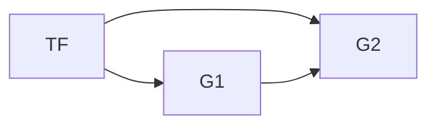
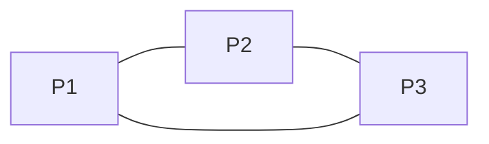
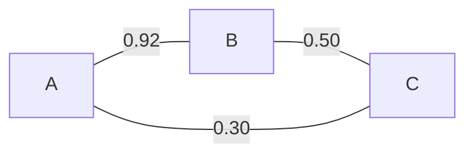
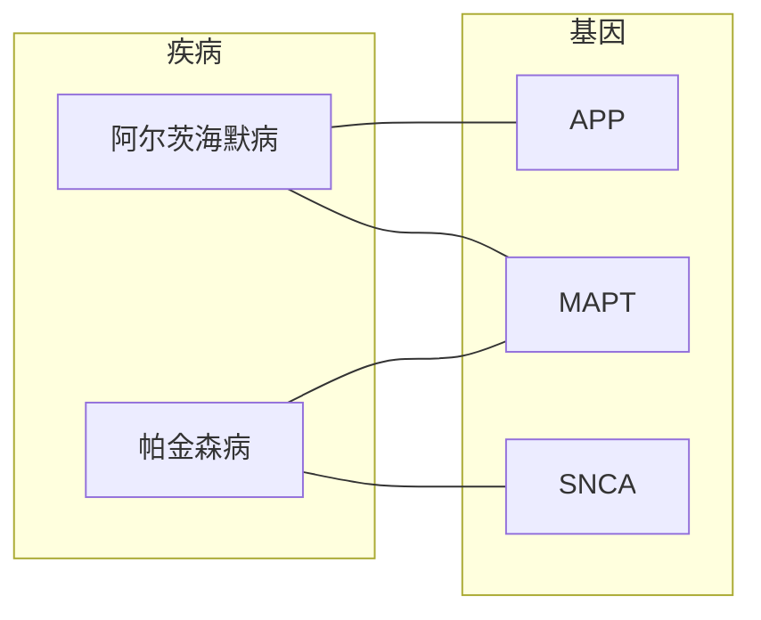
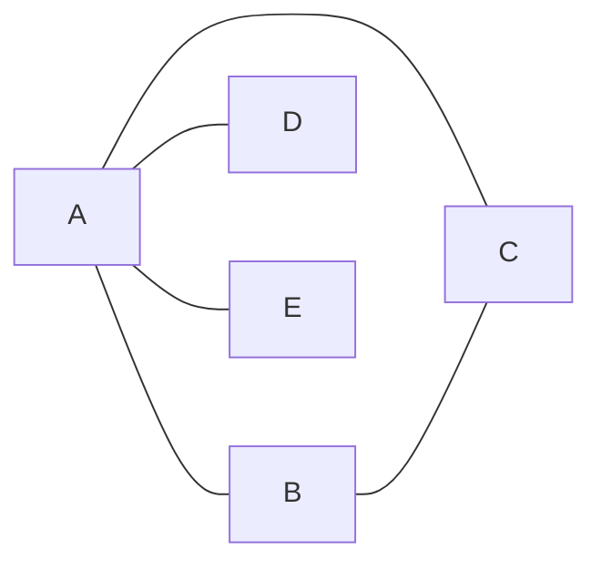
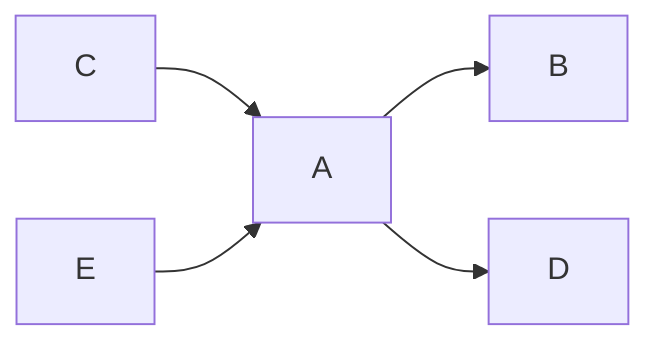
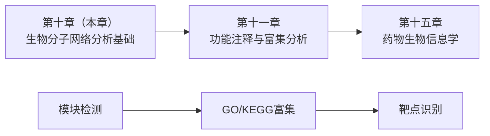

# 第十章 生物分子网络分析
## Biomolecular Network Analysis

---
layout: default
density: compact
---

# 本节学习目标 Learning Objectives

**Knowledge**
- 掌握生物网络基本类型与拓扑属性（度、聚类系数、介数中心性）
- 理解无标度网络、小世界网络与层次网络的特征

**Ability**
- 用 Cytoscape 进行网络可视化与拓扑分析，用 STRING 检索 PPI 信息
- 识别 Hub 节点与模块结构

**Thinking**
- 从"还原论"线性思维转向"系统论"整体性思维

---
layout: table-of-contents
contentTitle: '目录 | Contents'
contentItems:
  - 网络基本概念与分类
  - 网络拓扑属性
  - 数据库资源与工具演示
  - 网络重构简述
  - 总结与作业
---

<!-- notes:
阶段与时间安排：
好，我们这节课分五个阶段来讲。看这张路线图——第一阶段是网络基本概念与分类；第二阶段是网络拓扑属性，包括度分布、聚类系数、介数中心性，以及无标度网络、小世界网络和层次网络；然后课间休息；第三阶段是数据库资源介绍和 STRING + Cytoscape 工作流演示——这是后半节课的重点；第四阶段简要讲解网络重构；最后是总结和课后作业布置。

内容不少，但别紧张，我会带着大家一步一步走。现在开始。-->

---
layout: figure-side
slideTitle: 案例：阿尔茨海默病 (Alzheimer's Disease)
figureUrl: /assets/ch10/AD_PPI_Network.jpeg
figureCaption: AD 相关蛋白质互作 (PPI) 网络
---

## 观察：AD 基因在 PPI 网络中不是随机分布

AD 相关基因**聚集在特定的功能模块**中

<v-clicks>

> **思考**：为什么单基因分析无法发现这些模式？

</v-clicks>

<v-clicks>

学完今天的拓扑属性和工具演示，你们自己就能回答这个问题。

</v-clicks>

<!-- notes: 简要展示 AD PPI 网络，重点：AD 基因不是随机散落，而是聚集在功能模块中。留下悬念——为什么单基因分析看不到这种模式？不需要展开，目的是激发兴趣。 -->

---
layout: two-col
---

# 为什么研究网络？

::left::
### 传统视角：单个分子
***还原论观点***
- 一个基因 → 一个功能
- 一个蛋白 → 一个靶点
- 线性思维

::right::
### 网络视角：分子系统
***系统生物学观点***
- 基因间互作 → 系统功能
- 蛋白网络 → 协同调控
- **整体性思维**

<!-- notes: 强调范式转变的核心——单个分子研究无法解释复杂疾病。举例：癌症不是单个基因突变导致的，而是整个调控网络的紊乱。 -->

---
layout: section
sectionNumber: 1
sectionTitle: '网络的基本概念'
sectionTitleEn: 'Basic Concepts of Networks'
---

---
layout: default
---

# 图 (Graph) 的表示

$$G = (V, E)$$

| 符号 | 含义 | 生物学对应 |
|------|------|-----------|
| $V$ (vertices) | 节点集合 | 蛋白质、基因、代谢物 |
| $E$ (edges) | 边集合 | 相互作用、调控关系 |


---
layout: default
---

# 有向网络 (Directed Network)

<div class="grid grid-cols-2 gap-8 items-center">
<div class="text-center">



</div>
<div>

- 边**有方向**：A → B，但 B → A 不一定成立
- 例：**转录因子 (TF)** 调控靶基因表达
- $E = \{(u, v)\}$，$(u,v) \neq (v,u)$

<div class="mt-4 text-sm opacity-70">
为什么转录调控网络是有向的？——TF 结合到靶基因启动子上调控表达，是"谁调控谁"的关系
</div>

</div>
</div>

<!-- notes: 互动提问：为什么 PPI 网络是无向的，而转录调控网络是有向的？PPI 的边代表对称的物理/遗传互作，而转录调控有明确方向性。 -->

---
layout: default
---

# 无向网络 (Undirected Network)

<div class="grid grid-cols-2 gap-8 items-center">
<div class="text-center">



</div>
<div>

- 边**无方向**：关系是对称的
- PPI 包括**物理互作**（空间构象/化学键结合）和**遗传互作**（功能表型关联）
- 不存在"谁主动谁被动"的问题 → 通常建模为无向

</div>
</div>

<!-- notes: PPI 网络是无向的，因为蛋白质互作关系通常是对称的。 -->

---
layout: default
---

# 加权与等权网络 (Weighted & Unweighted)

<div class="grid grid-cols-2 gap-8 items-center">
<div class="text-center">



<div class="text-xs opacity-60 mt-2">
STRING 置信度评分示例
</div>

</div>
<div>

### 加权网络 (Weighted)
- 每条边带一个**数值权重**
- 例：STRING 数据库的互作置信度评分（0.92 比 0.30 更可靠）
- $w: E \rightarrow \mathbb{R}$

<div class="mt-4">

### 等权网络 (Unweighted)
- 所有边**一视同仁**，无强弱区分

</div>

</div>
</div>

<!-- notes: 加权=强弱之分，STRING 的置信度评分是典型例子。等权就是所有边都一样。 -->

---
layout: default
---

# 二分网络 (Bipartite Network)

<div class="grid grid-cols-2 gap-8 items-center">
<div class="text-center">



</div>
<div>

- 节点分成**两个互不相交**的集合
- 边**只在两个集合之间**建立，集合内部没有边
- $V = V_1 \cup V_2$，边只在 $V_1$-$V_2$ 之间

<div class="mt-4 text-sm opacity-70">
经典案例：Goh et al. 2007, PNAS — "The Human Disease Network"（疾病-基因关联网络），揭示看似不相关的疾病可能共享同一个致病基因
</div>

</div>
</div>

<!-- notes: 二分网络的两类节点：疾病和基因。类似还有药物-靶点网络。 -->

---
layout: default
---

# 通路与网络的关系

**通路 (Pathway)**：一系列生物化学分子通过级联反应完成特定生物学过程

**网络 (Network)**：多个通路交织形成的全局互联结构

| 特征 | 通路 | 网络 |
|------|------|------|
| 范围 | 单一生物学过程 | 全局互作关系 |
| 结构 | 线性/分支 | 复杂图结构 |
| 示例 | PI3K/AKT 信号通路 | 全蛋白质互作组 |

<div class="mt-4">
<b>关系</b>：通路是网络的子结构 → 网络是通路的集成
</div>

---
layout: figure
slideTitle: 通路与网络的关系
figureUrl: /assets/ch10/Pathway_vs_Network.jpg
figureCaption: TP53-AKT1-mTOR 信号相关蛋白互作（无向网络)
---

---
layout: section
sectionNumber: 2
sectionTitle: '生物网络类型概览'
sectionTitleEn: 'Overview of Biological Network Types'
---

---
layout: default
---

# 蛋白质互作网络 (PPI Network)

**定义**：蛋白质之间通过物理互作和遗传互作形成的相互作用网络

- **节点**：蛋白质
- **边**：互作关系（无向），包括物理互作（空间构象或化学键结合）和遗传互作（功能表型关联）
- **数据来源**：酵母双杂交 (Y2H)、免疫共沉淀 (Co-IP)、质谱、计算预测

**生物学意义**：
- 揭示蛋白质功能（"牵连 guilt-by-association"原则）
- 识别功能复合物和信号通路
- 疾病基因优先级排序

<div class="text-sm mt-2 p-2 bg-amber-50 rounded">
💡 STRING 的边 = PPI 的物理/遗传互作 + 计算预测的<b>功能关联</b>（共表达、基因组共现、文本挖掘等）。换言之，STRING 是<b>蛋白质功能关联网络 (Protein Association Network)</b>，比 PPI 更宽泛。详见第四节。
</div>

**常用数据库**：STRING, BioGRID, IntAct, DIP

---
layout: default
---

# 基因调控网络 (GRN)

**定义**：描述基因之间调控关系的网络

- **节点**：基因 / 基因产物
- **边**：调控关系（有向，可正可负）
- 包括：转录调控、转录后调控、翻译后调控

**三层调控结构**：

| 层次 | 调控方式 | 示例 |
|------|---------|------|
| 转录水平 | TF → 靶基因启动子结合 | p53 → *CDKN1A* |
| 转录后水平 | miRNA → mRNA 抑制 | miR-21 → *PTEN* |
| 翻译后水平 | 蛋白修饰调控 | 激酶磷酸化级联 |

> 描述的是基因之间的抽象调控关

---
layout: default
---

# 转录调控网络 (TRN)

**定义**：转录因子 (TF) 与靶基因之间的调控关系网络

- **节点**：转录因子 + 靶基因
- **边**：TF 结合启动子/增强子调控靶基因（有向）
- **二分结构**：TF 群 → 基因群

**关键特征**：
- **层级结构**：master TF → intermediate TF → 目标基因
- **Feed-forward loop (前馈环)**：最常见的网络模序之一
- **数据来源**：ChIP-seq, motif 预测

**常用数据库**：TRRUST, ChIP-Atlas, ENCODE, PlantRegMap（国产）

---
layout: default
---

# 转录后调控网络 (Post-TRN)

**定义**：RNA 水平的调控关系网络

**主要类型**：
- **miRNA-mRNA 网络**：miRNA 降解或抑制靶 mRNA
- **ceRNA 网络（竞争性内源RNA）**：miRNA 可结合 mRNA 抑制其表达，但 lncRNA、circRNA、其他 mRNA 上也存在 miRNA 结合位点 (MRE)。多个 RNA 分子竞争同一条 miRNA——就像几个人抢同一辆出租车，谁多抢一点，其他人就少被抑制一点。通过这种竞争关系形成调控网络
- **RNA结合蛋白 (RBP) 网络**：RBP 与靶 mRNA 的互作

**应用**：
- 肿瘤中 ceRNA 网络解析
- miRNA 靶基因预测与验证

---
layout: default
---

# 代谢网络 (Metabolic Network)

**定义**：酶催化反应中代谢物转化的网络

- **节点**：代谢物 + 酶
- **边**：生化反应（有向，底物 → 产物）
- **二分网络**：酶 ↔ 代谢物

**独特特征**：
- 化学计量关系 (stoichiometry) 约束
- 基因组尺度代谢模型 (GEM) 可量化模拟
- 通量平衡分析 (FBA) 预测代谢通量

**常用数据库**：KEGG METABOLISM, MetaCyc, Reactome, BiGG Models

---

# 6. 信号转导网络 (Signal Transduction Network)

**定义**：细胞感知外界信号后引发级联反应的分子网络

- **节点**：受体、激酶、转录因子等信号分子
- **边**：磷酸化、结合等信号传递关系（有向）
- **特征**：高度**层级化**，从膜受体到核内效应器

**经典通路举例**：
- PI3K/AKT/mTOR — 细胞生长与存活
- RAS/MAPK — 细胞增殖与分化
- JAK/STAT — 免疫信号传导

> 信号网络整合多通路，交叉对话 (crosstalk) 是常态

---
layout: default
density: compact
---

# 复合调控网络

**复合调控网络 (Composite Regulatory Network)**

在真核生物中，转录因子和 miRNA 协同调控——转录因子开启基因转录，miRNA 在转录后水平把关

> 好比公司的"双层管理"——总经理做决策，部门经理执行和修正

---
layout: default
density: compact
---

# 小结：网络类型

| 有向网络 (Directed) | 无向网络 (Undirected) | 取决于建模方式 |
|---------|---------|-----------|
| 基因调控网络 | PPI 网络 | 代谢网络 |
| 转录调控网络 | | (常按底物→产物建模为有向) |
| 转录后调控网络 | | |
| 信号转导网络 | | |

> **思考题**：为什么 PPI 网络是无向的，而转录调控网络是有向的？

<!-- notes: 快速检测理解：PPI是物理接触（无方向性），转录调控是"谁调控谁"（有方向性）。 -->

---
layout: section
sectionNumber: 3
sectionTitle: '网络拓扑属性'
sectionTitleEn: 'Network Topological Properties'
---

---
layout: two-col
density: compact
---

# 网络数据表示格式

> **拓扑分析的前置知识**：了解网络数据在计算机中的存储方式 [§10.4(一)]

**边列表 (Edge List)** — 最常用的网络数据格式

每行一条边：`节点A  节点B  权重`

::left::

**边列表示例**：
```
TP53   MDM2     0.95
TP53   ATM      0.89
MDM2   ATM      0.72
```

<div class="text-sm mt-2">
Cytoscape、NetworkX、R igraph 均可直接导入<br/>
STRING 导出的 TSV 即为此格式
</div>

::right::

**邻接矩阵 (Adjacency Matrix)** [§10.3(一) 自行阅读]

用方阵表示节点间连接关系：

$$A = \begin{pmatrix} 0 & 0.92 & 0.87 \\ 0.92 & 0 & 0.71 \\ 0.87 & 0.71 & 0 \end{pmatrix}$$

<!-- notes: 进入拓扑属性之前，先了解网络数据的存储格式。边列表最通用——Cytoscape、NetworkX、R igraph 都支持，STRING 导出的 TSV 就是边列表。邻接矩阵用于数学分析，有兴趣同学自行阅读 §10.3(一)。 -->

---
layout: default
---

# 度分布 (Degree Distribution)

> **全局网络度量**（课后阅读 §10.3(一)(六)）：连通分量（"岛"） · 最短路径 · 平均路径长度 · 直径

**度分布函数 $P(k)$** — 区分网络类型的"指纹" [§10.3(九)]

**定义**：随机选取一个节点，其度恰好等于 $k$ 的概率——即度数为 $k$ 的节点占全部节点的比例

$$P(k) = \frac{\text{度数为 } k \text{ 的节点数}}{\text{节点总数}}$$

- 度分布是区分不同网络类型的"指纹"——后续讲解无标度网络时会展示其威力。

---
layout: default
---

# 拓扑属性概述

**为什么需要拓扑属性 (Topological Properties)？**

→ 定量描述网络结构特征 → 识别关键节点 → 理解网络功能

| 拓扑属性 | 核心问题 | 生物学意义 |
|---------|---------|-----------|
| 度 (Degree) | 谁连接最多？ | Hub 蛋白富集必需/疾病基因 |
| 聚类系数 (Clustering Coefficient) | 邻居间是否互连？ | 功能模块紧密程度 |
| 介数中心性 (Betweenness) | 谁是信息桥梁？ | 信号传递瓶颈节点 |

---
layout: default
---

# 度与 Hub 节点

**度 (Degree)**：节点 $v$ 的边数

$$k_v = \text{与节点 } v \text{ 相连的边数}$$

**Hub 节点**：度值远高于平均的节点

| 度值特征 | 生物学含义 |
|---------|-----------|
| 高度 (hub) | 富集必需基因，敲除更可能导致致死表型 |
| 低度 | 功能特异性基因 |
| 平均度 $\langle k \rangle$ | 网络整体连通性 |


**关键发现**：1. Hub 蛋白倾向于保守进化（演化速率慢）2. Hub 蛋白与疾病高度相关 3. 网络中少数 hub 节点承担大部分连接

---
layout: two-col
---

# 度与 Hub 节点

::left::

**无向网络** — 度 = 连接边数



<div class="text-xs mt-1">

节点 A 的度 $k_A = 4$（hub）

</div>

::right::

**有向网络** — 入度 / 出度



<div class="text-xs mt-1">

节点 A：入度 = 2，出度 = 2

</div>

<!-- notes: 度是最直观的拓扑属性。强调：(1) hub 节点富集必需基因——不是等号关系，是统计趋势。 -->

---
layout: two-col
---

# 度分布 (Degree Distribution)

## **度分布 $P(k)$**：随机选择一个节点，其度值为 $k$ 的概率

::left::

### 随机网络 (Random Network)
- Erdős–Rényi 模型
- 度分布：泊松分布
- $P(k) \approx e^{-\langle k \rangle} \frac{\langle k \rangle^k}{k!}$
- 大多数节点度数相近

::right::

### 无标度网络 (Scale-Free Network)
- Barabási-Albert 模型
- 度分布：幂律分布
- $P(k) \sim k^{-\gamma}$
- 少数 hub + 大量低连接节点
- **双对数坐标诊断**：对 $P(k) \sim k^{-\gamma}$ 取对数得 $\log P(k) = -\gamma \log k + \text{const}$，双对数图上近似直线提示幂律分布

---
layout: default
---
# 度分布 (Degree Distribution) (Cont.)

<div class="mt-4">
<b>核心区别</b>：随机网络"均匀连接"，无标度网络"少数枢纽"。
</div>


<div class="mt-4 p-4 bg-slate-50 rounded text-sm">

| 网络类型 | 度分布 | 分布形态 | 典型 $\gamma$ | 例子 |
|---------|--------|---------|-------------|------|
| 随机网络 (ER) | 泊松分布 $P(k) \approx e^{-\langle k \rangle}\frac{\langle k \rangle^k}{k!}$ | 钟形，峰值在 $\langle k \rangle$ | — | 随机连接模型 |
| 无标度网络 (BA) | 幂律分布 $P(k) \sim k^{-\gamma}$ | 长尾，少数 hub | $2 < \gamma < 3$ | PPI 网络、互联网 |
| 层次网络 | 幂律 + 指数截断 | 模块化 hub | 可变 | 代谢网络 |

</div>

<div class="mt-3 p-3 bg-amber-50 rounded text-sm">
<b>⚠️ 注意</b>：PPI 网络中观察到的无标度特征可能部分源于<b>诱饵-猎物 (bait-prey) 实验模式的采样偏差</b>以及目前数据资源尚不完整。解读度分布时需结合样本规模、数据来源和拟合质量综合判断。
</div>

<!-- notes: 度分布是区分网络类型的关键。核心对比：泊松分布（钟形，随机网络）vs 幂律分布（长尾，无标度网络）。双对数坐标下的直线 = 幂律。这是理解"为什么 hub 如此重要"的数学基础。 -->

---

# 聚类系数 (Clustering Coefficient)

**定义**：节点 $v$ 的邻居之间实际连接数与可能连接数的比值

$$C_v = \frac{2L_v}{k_v(k_v - 1)}$$

- $L_v$：节点 $v$ 的邻居之间实际存在的边数
- $k_v$：节点 $v$ 的度
- $C_v \in [0, 1]$：$C_v = 1$ 表示邻居全互连

**直觉理解**：
- $C_v$ 高 → 邻居之间也互为朋友 → 形成紧密团簇
- $C_v$ 低 → 邻居之间不相连 → 星形结构

**生物学意义**：高聚类系数 → 功能模块内紧密协作

<!-- notes: 用社交网络类比：你的朋友圈里朋友之间也互为朋友 = 高聚类系数。 -->

---

# 介数中心性 (Betweenness Centrality)

**定义**：经过节点 $v$ 的最短路径数占所有最短路径数的比例

$$B_v = \sum_{i \neq j \neq v \in V} \frac{\sigma_{ivj}}{\sigma_{ij}}$$

- $\sigma_{ij}$：节点 $i$ 到 $j$ 的最短路径总数
- $\sigma_{ivj}$：其中经过 $v$ 的最短路径数

**直觉理解**：介数高 = 信息传递的"必经之路" = 瓶颈

**生物学意义**：
- 高介数节点 → 信号传递关键枢纽
- 敲除后网络通信效率急剧下降
- 是潜在的药物靶点

> 其他中心性指标：紧密度中心性 (closeness)、拓扑系数 (topological coefficient)、特征向量中心性 (eigenvector centrality)

<!-- notes: 介数中心性公式看起来复杂，但直觉很简单：这个节点是不是"必经之路"？类比：城市交通中的桥梁或隧道。介数高 ≠ 度高——有些"桥梁节点"连接度不高但处于关键路径上。 -->

---

# 无标度网络 (Scale-Free Network)

**特征**：度分布服从幂律分布 (Power-Law Distribution)

$$P(k) \sim k^{-\gamma}, \quad \gamma \text{ 通常在 } 2 \sim 3 \text{ 之间}$$

**Barabási-Albert 模型的两条机制**：
1. **增长 (Growth)**：网络持续添加新节点
2. **优先连接 (Preferential Attachment)**：新节点倾向连接高度节点 → "富者愈富"

<div class="mt-3 text-sm">
<b>进化解释</b>：<b>基因复制假说</b>——细胞分裂时基因被复制，复制产生的蛋白与相同的互作伙伴结合。高度连接的蛋白更可能与复制基因产物发生互作，从而获得额外的连接——又是"富者愈富"。
</div>

**生物学意义**：

<v-click>

- **鲁棒性 (Robustness)**：随机攻击大部分节点 → 网络功能基本不受影响
- **脆弱性 (Vulnerability)**：定向攻击少数 hub 节点 → 网络迅速瓦解

</v-click>

<v-click>

<div class="mt-4 text-sm">
<b>临床启示</b>：疾病相关的 hub 基因是潜在的候选药物靶点，但靶向 hub 可能产生广泛副作用，需谨慎评估安全性。
</div>

</v-click>

<!-- notes: 无标度网络的数学核心：幂律分布 $P(k) \sim k^{-\gamma}$。生物学意义：(1) 网络对随机错误有鲁棒性（好消息）；(2) 对 hub 的定向攻击极其脆弱（这是为什么 hub 是潜在药物靶点，但安全性风险大）。BA 模型的"富者愈富"机制解释了为什么 hub 存在。 -->

---

# 小世界网络 (Small-World Network)

**特征**：同时具有高聚类系数和短平均路径长度

$$\langle l \rangle \sim \ln N, \quad C \gg C_{\text{random}}$$

- $\langle l \rangle$：平均最短路径长度
- $C$：平均聚类系数
- $N$：网络节点数

**"六度分隔"现象**：
- 社交网络中任意两人平均通过 6 步可以联系
- 生物网络中任意两个蛋白质平均通过 2-3 步互作可以关联

**生物学意义**：
- 信息/信号在生物网络中可快速传递
- 局部扰动可迅速波及全局

---
layout: two-col
---

# 层次网络 (Hierarchical Network)

**核心思想**：模块 + 无标度 → 层次化结构

::left::

**层次化特征**：
- 内部密集的小模块通过少数 hub 节点连接成大网络
- **聚类系数函数** $C(k) \propto 1/k$
  - 低连通度节点 → 聚类系数高（处于紧密模块内）
  - 高连通度 hub → 聚类系数低（连接不同模块）

::right::

**网络类型递进**：

```text
随机网络 (ER)
  → 无标度网络 (BA): P(k) ~ k^-γ
    → 层次网络: P(k) ~ k^-γ 且 C(k) ~ 1/k
```

大部分真实生物网络（代谢、PPI、蛋白质结构域）同时具有**模块性**、**无标度性**和**层次化**

<div class="mt-3 text-sm p-3 bg-blue-50 rounded">
<b>直觉</b>：hub 节点连接不同的功能模块，因此虽然度很高，但邻居之间互连的比例（聚类系数）反而低。这正是层次网络的标志。
</div>

<!-- notes: 层次网络串联了前面讲的"无标度"和"模块"两个概念。关键公式 C(k) ~ 1/k 是判断层次化的标志。用教材 Fig 10-4C 辅助讲解。 -->

---

# 网络模块 (Network Module)

**定义**：网络中内部连接紧密、外部连接稀疏的子图 (Subgraph)

<div class="mt-4">

**模块检测算法**：
- **MCODE** (Molecular Complex Detection)：基于顶点加权，Cytoscape 插件
- **Louvain**：基于模块度 (modularity) 优化
- **社区发现算法**：Walktrap, Infomap

</div>

<v-click>

**模块的生物学含义**：
- 功能模块：同一模块内的蛋白质/基因倾向于参与相同的生物学过程
- "牵连"原则 (guilt-by-association)：模块内已知功能基因可推测未知基因功能

</v-click>

<v-click>

<div class="mt-4">
<b>下游分析</b>：模块 → 功能富集分析 (GO/KEGG) → 生物学解读
</div>

</v-click>
---
layout: default
density: compact
---

# 网络模序 (Network Motif)

**定义**：在网络中出现频率远超随机期望的小型子图模式（教材 §10.3.三(二)）

**有向网络模序**（教材 Fig 10-5）：

| 模序类型 | 结构 | 功能含义 |
|---------|------|---------|
| 自调控环 (Auto-Regulatory Loop) | A→A（正向/负向） | 稳态维持 / 自我抑制 |
| 前馈环 (Feed-Forward Loop) | A→B→C, A→C | 信号滤波、延迟响应（最常见） |
| 单输入模序 (Single-Input Motif) | 一个 TF → 多个靶基因 | 协同调控，保持基因表达比例 |

**无向网络模序**：

<div class="mt-3 p-3 bg-slate-50 rounded text-sm">
<b>全连接集 (Clique)</b>：任意两点都有边连接的子图。包含 n 个节点的全连接集称为 n-全连接集（教材 Fig 10-6）。是 CFinder 等模块检测算法的基础。
</div>

**与模块的区别**：
- 模序 = 局部微观模式（3-4个节点），重复出现
- 模块 = 中观功能单元（数十个节点），结构完整

---

# 生物网络的动态性 (Network Dynamics)

<div class="p-4 bg-blue-50 rounded border-l-4 border-blue-400">

**生物网络具有时空特异性——这是基本属性而非缺陷**（教材 §10.3.四）：

- **时间依赖性**：PPI 在细胞周期不同阶段差异显著；发育过程中调控网络重构
- **组织/细胞类型特异性**：脑组织的 PPI 网络与肝脏不同；同一个基因在不同组织中可能不是 hub
- **条件依赖性**：疾病 vs. 正常、药物处理 vs. 对照的网络拓扑可能截然不同
- **数据不完整性**：实验检测存在假阳性/假阴性；低表达蛋白互作容易被遗漏

</div>

<div class="mt-4 text-sm">
<b>启示</b>：时空特异性使我们能够构建条件特异的网络，更准确地揭示特定生理/病理状态下的分子机制。解读结果时务必注明数据来源和条件背景。
</div>

<div class="mt-3 text-sm p-3 bg-green-50 rounded">
<b>思考</b>：如何从动态数据中重构网络？→ 第五节将回答这个问题。
</div>

---
layout: default
density: compact
---

# 第二部分小结：拓扑属性一览

| 属性 | 公式核心 | 直觉 | 生物学意义 |
|------|---------|------|-----------|
| 度 $k_v$ | 连接数 | 谁最受欢迎 | Hub 富集必需基因 |
| 聚类系数 $C_v$ | 邻居互连比例 | 朋友间是否也是朋友 | 功能模块紧密度 |
| 介数 $B_v$ | 最短路径经过数 | 谁是必经之路 | 信号传递瓶颈 |
| 度分布 $P(k)$ | 连接数统计 | 均匀还是两极分化 | 无标度 vs. 随机 |
| 层次网络 | $C(k) \propto 1/k$ | hub 连接不同模块 | 模块+无标度→层次化 |
| 模块 | 内密外疏 | 兴趣小组 | 功能单元 |
| 模序 | 过代表的微模式 | 反复出现的合作模式 | 调控逻辑单元 |

<div class="mt-4 p-4 bg-blue-50 rounded">
<b>快速检查</b>：一个蛋白与 100 个蛋白互作，但邻居之间几乎不互连——这说明什么？这与层次网络有什么关系？
</div>

<!-- notes: 度高（hub），聚类系数低（星形结构）。这类蛋白往往是"桥梁蛋白"，连接不同功能模块——正是层次网络 C(k) ~ 1/k 的体现。 -->

---
layout: break
breakMinutes: 10
---

休息后继续：数据库资源与工具演示

---
layout: section
sectionNumber: 4
sectionTitle: '数据库资源与工具演示'
sectionTitleEn: 'Database Resources & Tool Demonstration'
---

---
layout: default
density: compact
---

# 主要网络数据库概览

| 网络类型 | 数据库 | 核心功能 | 特色 |
|---------|--------|---------|------|
| **PPI** | **STRING** | 多证据整合互作网络 | 7种证据源，2,031物种 |
| | **BioGRID** | 文献 curated 互作数据 | 人工审阅，质量高 |
| | **DIP** | 实验验证的 PPI | 数据库质量管控 |
| | **IntAct** | 分子互作 | IMEx 联盟成员 |
| | **HPRD** | 人类蛋白质参考数据库 | 人类专用 |
| **转录调控** | **TRRUST** | TF-靶基因调控 | 文本挖掘+人工审阅 |
| | **JASPAR** | TF 结合位点 motifs | 核酸序列模式 |
| | **hTFtarget** | 人类 TF-靶基因 | 综合数据库 |

---
layout: default
density: compact
---
# 主要网络数据库概览 (Cont.)

| 网络类型 | 数据库 | 核心功能 | 特色 |
|---------|--------|---------|------|
| **转录后** | **miRBase** | miRNA 注释与靶基因预测 | miRNA 权威数据库 |
| **代谢/信号** | **KEGG** | 代谢/信号通路图谱 | 手动绘制，广泛引用 |
| | **Reactome** | 人类生物学通路 | 反应级详细 |
| | **WikiPathways** | 协作式通路数据库 | 社区贡献 |

---
layout: default
density: compact
---

# STRING 数据库详解

**STRING** (Search Tool for Retrieval of Interacting Genes/Proteins)

覆盖 **2,031 物种**，约 960 万已知蛋白 + 1,380 万预测蛋白的互作关系

<div class="text-xs">

| 证据类型 | 说明 | 权重 |
|---------|------|------|
| 实验验证 (Experiments) | Y2H, Co-IP 等小规模和高通量实验 | 高 |
| 数据库注释 (Databases) | BioGRID, IntAct 等 curated 数据库 | 高 |
| 文本挖掘 (Text Mining) | 文献中两个基因被同时提及的频率 | 中 |
| 共表达 (Co-expression) | 基因表达数据中的相关性 | 中 |
| 基因邻域 (Genomic Context) | 基因组位置保守性 | 低-中 |
| 基因共现 (Co-occurrence) | 不同物种基因组中基因出现/消失的共变模式，又称系统发育谱 (Phylogenetic Profile) | 中 |
| 融合事件 (Gene Fusion) | 基因融合事件的证据 | 低-中 |

</div>

---
layout: default
density: compact
---

# STRING 数据库详解
<div class="mt-3 p-3 bg-red-50 rounded">
<b>⚠️ 注意</b>：STRING 默认提供 full network（功能关联网络），其中的 physical subnetwork 才更接近狭义 PPI。STRING 边 ≠ 一定是物理相互作用——部分关联为<b>预测的功能关联</b>。使用时应关注证据类型与置信度评分。
</div>


<div class="mt-3 p-3 bg-blue-50 rounded">
<b>PPI 数据可靠性评估</b>（教材 §10.4.三(一)）：<br>
1. 小规模实验（Co-IP 阳性）= <b>金标准</b> <br>
2. 高通量互作需多条独立证据支持 <br>
3. STRING 综合置信度评分 (combined score) 通常 > 0.7 为高置信度
</div>

**使用方式**：
1. 输入基因/蛋白名称
2. 设置置信度阈值（如 0.7 = high confidence）
3. 导出网络（TSV → 导入 Cytoscape）

---

# STRING 查询演示

**以 TP53 蛋白为例的完整查询流程**：

**Step 1**：打开 string-db.org → 点击 "SEARCH" → 选择 "Protein by name" → 输入 "TP53" → 物种选择 *Homo sapiens* → 点击 "SEARCH"

**Step 2**：选择结果 → 点击 "CONTINUE" → 生成 PPI 网络图

**Step 3**：查看网络图——节点为蛋白质，连线颜色代表不同证据类型（粉红=实验验证，蓝色=数据库注释，绿色=文本挖掘，黑色=共表达）。线越粗，置信度越高

**Step 4**：调整参数 → "Settings"：minimum score（置信度阈值）、max interactors（互作蛋白数量上限）、network display mode

**Step 5**：读懂 Legend → 点击 "Legend" 了解各元素含义

**Step 6**：导出数据 → "Exports" → 选择 **TSV 格式**下载（用于 Cytoscape）

<!-- notes: 用 TP53 做演示——TP53 是重要的抑癌基因，与课后操作指南一致。流程总结：查询→查看网络→调参数→导出，四步走。 -->

---
layout: default
density: compact
---

# Cytoscape 网络可视化平台

**Cytoscape** — 生物网络分析的黄金标准，开源、免费

**核心优势**：丰富的可视化定制 + **插件 (Apps) 生态**（全球开发者贡献了上百个插件）

| 插件 | 功能 |
|------|------|
| **MCODE** | 模块/复合物检测 |
| **cytoHubba** | Hub 节点识别（12种算法） |
| **stringApp** | 直接在 Cytoscape 里连接 STRING API |

<!-- notes: 今天带大家走一遍从 STRING 导出数据到 Cytoscape 可视化的完整流程。课后按 PDF 指南自行练习。 -->

---

# Cytoscape 操作演示：TP53 PPI 网络

**从 STRING 导出数据到 Cytoscape 可视化的完整流程**：

**Step 1：导入网络** — 将 STRING 导出的 TSV 文件直接**拖拽**到 Cytoscape 窗口（或 File → Import → Network from File）

**Step 2：显示节点标签** — Style → Label → Column: "Shared name" → Mapping Type: "Passthrough Mapping"

**Step 3：计算 Degree 值** — Tools → Analyze Network → OK。Cytoscape 计算每个节点的 Degree（度）

**Step 4：按 Degree 着色** — Style → Fill Color → Column: "Degree" → Mapping Type: "Continuous Mapping" → 选择颜色渐变（如蓝色→红色）

**Step 5：按 Degree 调整大小** — Style → Size → Column: "Degree" → Mapping Type: "Continuous Mapping" → 设置范围（如 10–50）

**Step 6：调整布局** — Layout → "Prefuse Force Directed"（力导向）或 "Attribute Circle Layout"（按 Degree 同心圆排列）

**Step 7：微调美化** — 调整标签字体、边的粗细和颜色、整体间距

**Step 8：导出图片** — File → Export → Network to Image → PNG

<!-- notes: 能力目标的核心教学环节。重点展示完整流程，学生课后按指南自行练习。 -->

---

# PPI 网络分析流程总结

<div class="mt-5 p-5 bg-yellow-50 rounded text-lg font-bold">
STRING 查询 → 调整参数 → 导出 TSV → Cytoscape 导入 → 显示标签
→ 计算 Degree → 按 Degree 着色/调大小 → 调整布局 → 美化 → 导出图片
</div>

**上游**：STRING 数据库提供数据——输入蛋白名称，输出互作网络

**中游**：Cytoscape 负责可视化和分析——导入数据、布局、按拓扑属性着色、识别 Hub 节点

**下游**：功能解读——识别模块、做功能富集分析（第十一章系统学习）

<div class="mt-3 p-3 bg-green-50 rounded text-sm">
💡 详细的操作步骤在课后 PDF 指南中，大家按指南自己练习。Cytoscape 插件（MCODE、cytoHubba、stringApp）可在课后自行探索。
</div>

---
layout: section
sectionNumber: 5
sectionTitle: '网络重构简述'
sectionTitleEn: 'Network Reconstruction Overview'
---

---

# 网络重构方法概览

**从数据到网络——三大重构策略**：

| 策略 | 原理 | 适用场景 |
|------|------|---------|
| **文献挖掘** | 从发表论文中提取二元关系 | 已有大量文献积累的领域 |
| **高通量实验整合** | Y2H, Co-IP, ChIP-seq 直接检测 | 可设计实验的互作验证 |
| **共表达分析** | 基因表达相关性推断功能关系 | 转录组数据驱动的网络构建 |

<div class="mt-4 p-4 bg-green-50 rounded text-lg">
网络重构是连接"网络动态性"与"实际应用"的桥梁——从动态、条件特异的数据中构建准确的生物网络。
</div>

---
layout: two-col
---

# 共表达网络与 WGCNA

::left::

**教材基础方法**（§10.4.二）：
- 基于 Pearson 相关性：选定阈值 → 显著相关的基因对 → 构建网络
- 基于互信息：能捕捉**非线性关系**

::right::

**WGCNA 核心改进**：
- **软阈值 (Soft Thresholding)** — 用幂函数 $a_{ij} = |r_{ij}|^\beta$ 将相关性转换为连续邻接权重，不硬性截断
- 识别**共表达模块** → 与**外部性状**关联（如疾病状态）

<div class="mt-2 text-sm opacity-70">
WGCNA 在肿瘤转录组研究中非常常用，详细方法在后续课程和研究生阶段深入学习。
</div>

---

# 布尔网络模型 (Boolean Network Model)

**核心思想**：把基因表达简化为"开/关"（1 或 0），用逻辑规则描述调控关系

```text
示例：IF (A = 1) AND (B = 0) → C = 1
      "如果基因 A 表达且基因 B 不表达，则基因 C 表达"
```

- **优势**：直观易懂，揭示调控逻辑
- **局限**：只捕获二元状态，忽略表达量连续变化

<div class="mt-4 text-sm">
网络重构方法很多，今天只是概览。WGCNA 和布尔网络的详细内容，在后续课程和研究生阶段会深入学习。
</div>

---
layout: two-col
---

# 本章总结

::left::

### 核心概念
1. 图 $G=(V,E)$ 的网络表示
2. 6 种生物网络类型（PPI、基因调控、转录调控、转录后、代谢、信号转导）
3. 拓扑属性：度、聚类系数、介数、度分布 $P(k)$
4. 网络模型：无标度（幂律）、小世界（高聚类+短路径）、层次（$C(k) \propto 1/k$）
5. 模块、模序与网络动态性（时空特异性）

::right::

### 核心工具
1. **STRING** — 蛋白质功能关联/互作证据数据库
2. **Cytoscape** — 网络可视化和拓扑分析

---

# 知识脉络：与后续章节的联系



第十章到第十一章的桥梁是**功能富集分析**——检测出模块后需要知道模块在做什么。
第十章到第十五章的桥梁是**网络药理学**——网络分析在药物靶点发现中的直接应用。

---
layout: default
---

# 课后作业 Assignment

按照课后操作指南（《STRING_and_CytoScape_Tutorial》），独立完成以下任务：

1. 使用 STRING 数据库查询 **TP53** 蛋白（*Homo sapiens*）的互作网络
2. 将网络数据导出为 TSV 格式，导入 Cytoscape
3. 在 Cytoscape 中完成以下操作：
   - 计算各节点的 Degree 值
   - 按 Degree 值设置节点颜色（渐变色）
   - 按 Degree 值设置节点大小
   - 调整布局使网络美观
   - 导出最终网络图为 PNG 格式

---
layout: default
---

# 课后作业 Assignment (Cont.)

4. 回答以下问题：
   - **Q1**: TP53 的互作网络中，哪些蛋白是 Hub 节点？（列出 Top 5）为什么它们是 Hub？
   - **Q2**: STRING 中不同颜色的连线代表什么含义？TP53 与哪个蛋白之间的互作证据最充分？
   - **Q3**: 生物分子网络具有时空特异性——请解释这个概念，并举一个具体例子
   - **Q4**: 层次网络中，Hub 节点的聚类系数通常较低——为什么？（提示：$C(k) \propto 1/k$）

**提交要求**：STRING 网络截图 + Cytoscape 美化后网络截图 + 问题回答（PDF）

**评分标准**：
- 网络构建正确（参数符合要求）：25%
- Cytoscape 可视化完成（着色、大小、布局）：25%
- 问题回答准确（Q1-Q4）：40%
- 格式规范、按时提交：10%

---
layout: end
endMessage: '谢谢聆听'
endMessageEn: 'Thank You'
---
