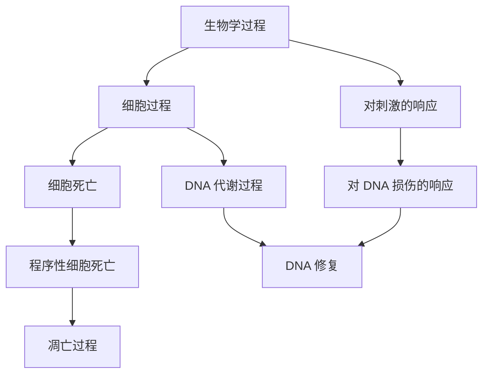
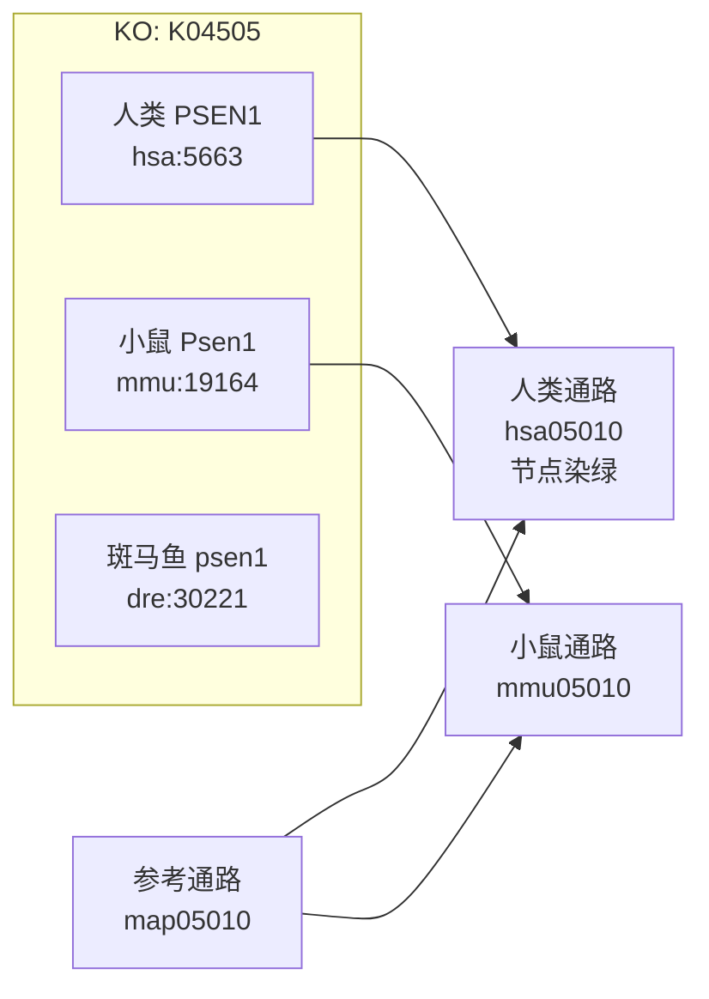
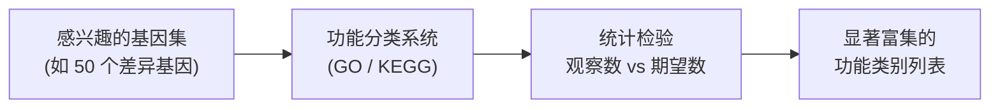
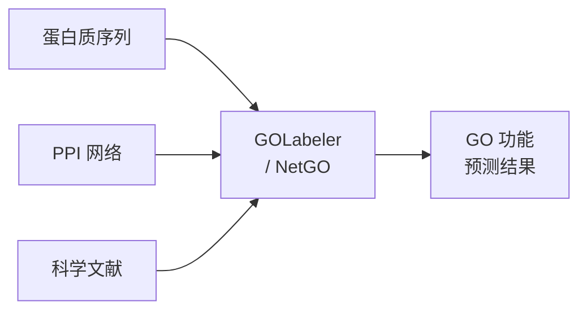
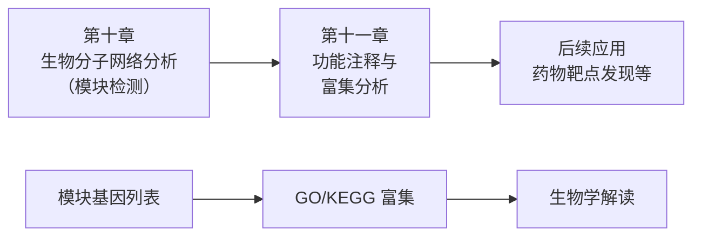

# 第十一章 基因功能注释与富集分析
## Function Annotation and Enrichment Analysis

---
layout: default
---

# 本节学习目标 Learning Objectives

**Knowledge**
- 掌握 GO 三大命名空间 (BP/MF/CC) 与 DAG 结构；理解 KEGG 通路数据库核心模块
- 理解富集分析的核心逻辑、ORA 与 GSEA 的区别、多重检验校正的必要性

**Ability**
- 用 AmiGO/QuickGO 检索 GO 注释；用 KEGG 查询通路信息
- 用 clusterProfiler 进行 GO/KEGG 富集分析与可视化

**Thinking**
- "富集" ≠ "因果"；功能注释具有动态性与不完备性

---
layout: table-of-contents
contentTitle: '目录 | Contents'
contentItems:
  - GO 数据库与功能注释
  - KEGG 数据库与富集分析概念
  - 数据库资源与工具演示
  - 功能预测简述
  - 总结与作业
---

<!-- notes:
阶段与时间安排：
好，我们分五个阶段来讲。第一阶段是 GO 数据库——统一的功能描述语言；第二阶段是 KEGG 数据库和富集分析的核心概念——这是认知重点；然后课间休息；第三阶段是工具演示——AmiGO、KEGG、clusterProfiler 的完整流程——这是后半节的核心；第四阶段简述功能预测方法；最后是总结和课后作业布置。

内容不少，但别紧张，我会带着大家一步一步走。现在开始。-->

---
layout: default
---

# 从第十章到第十一章

**第十章回顾**：PPI 网络分析 → 检测出功能模块

> **关键问题**：模块里的 30–50 个基因到底在做什么？

<v-clicks>

- 一个一个基因去查？每个基因有几十个功能注释 → 上千条信息
- 需要一种**系统化方法**：自动判断基因集在哪些功能上"扎堆"
- → **富集分析 (Enrichment Analysis)** + **功能注释数据库 (GO, KEGG)**

</v-clicks>

<!-- notes: 回顾第十章 AD PPI 网络案例。检测出模块只是第一步。这 50 个基因参与的是 DNA 修复还是细胞凋亡？一个一个查不现实。需要自动化方法——富集分析。但富集分析需要"字典"——GO 和 KEGG。-->

---
layout: section
sectionNumber: 1
sectionTitle: 'GO 数据库'
sectionTitleEn: 'Gene Ontology Database'
---

---
layout: default
---

# 什么是 GO (Gene Ontology)？

**基因本体论** — 为基因功能描述提供统一语言

<div class="mt-4">

| 问题 | 现状 | GO 的解决 |
|------|------|----------|
| "细胞凋亡"、"apoptosis"、"type I programmed cell death" | 不同名称，同一个生物学过程，计算机不知道 | 统一 GO term + 唯一标识号 |
| 不同数据库的注释格式各异 | 数据整合困难 | 标准化功能描述框架 |

</div>

<v-click>

<div class="mt-4">

**GO 的三层目标**：
1. 统一的功能描述词汇
2. 标准化的注释体系
3. 跨物种、跨数据库的功能比较

</div>

</v-click>

<!-- notes: GO 解决的是"统一语言"问题。全世界的研究者用不同语言描述同一个功能，GO 给每个概念一个唯一 ID。-->

---
layout: default
---

# GO 的 DAG 结构

**有向无环图 (Directed Acyclic Graph, DAG)**



<div class="mt-3 text-sm">
<b>关键</b>：一个子节点可以有多个父节点（如"DNA 修复"同时属于"DNA 代谢过程"和"对 DNA 损伤的响应"）——比简单的层级树更灵活
</div>

<!-- notes: DAG 不是简单的树。一个子节点可以有多个父节点，因为生物学概念本身就是多面的。-->

---
layout: default
---

# GO 三大命名空间 (Namespaces)

<div class="grid grid-cols-3 gap-4">
<div class="p-4 bg-blue-50 rounded">

### BP
**Biological Process**
生物学过程

"参与了什么过程？"

- 细胞凋亡
- DNA 修复
- 信号转导
- 免疫应答

</div>
<div class="p-4 bg-green-50 rounded">

### MF
**Molecular Function**
分子功能

"分子层面做什么？"

- 激酶活性
- DNA 结合
- ATP 酶活性
- 蛋白质结合

</div>
<div class="p-4 bg-amber-50 rounded">

### CC
**Cellular Component**
细胞组分

"在细胞哪里？"

- 细胞核
- 线粒体
- 细胞膜
- 染色质

</div>
</div>

<div class="mt-4 text-sm">
<b>三个命名空间独立</b>——同一基因可在 BP、MF、CC 中同时有注释
</div>

<!-- notes: 三大命名空间是 GO 最核心的概念。BP 回答"参与了什么过程"，MF 回答"分子层面做什么"，CC 回答"在细胞哪里"。同一个基因可以在三个空间中都有注释。-->

---
layout: default
---

# TP53 的 GO 注释示例

**同一基因，三个角度**

| 命名空间 | GO term | 含义 |
|---------|---------|------|
| **BP** | GO:0000077 | DNA damage checkpoint signaling（DNA 损伤检查点信号传导） |
| **BP** | GO:0043066 | negative regulation of apoptotic process（凋亡负调控） |
| **MF** | GO:0003700 | DNA-binding transcription factor activity |
| **MF** | GO:0005515 | protein binding |
| **CC** | GO:0005634 | nucleus（细胞核） |
| **CC** | GO:0000785 | chromatin（染色质） |

> 一个基因通常有**数十个** GO term 注释——这就是为什么需要富集分析来"浓缩"信息

---
layout: default
---

# GO 节点间常见关系

| 关系名称 | 缩写 | 含义 | 例子 |
|---------|------|------|------|
| is_a | IS | 子节点是父节点的一种（继承） | "DNA 修复" is_a "DNA 代谢过程" |
| part_of | P | 子节点是父节点的一部分 | "线粒体内膜" part_of "线粒体" |
| regulates | R | 子节点调控父节点 | "凋亡调控" regulates "凋亡" |
| positively_regulates | PR | 正调控 | "激活 T 细胞增殖" PR "T 细胞增殖" |
| negatively_regulates | NR | 负调控 | "抑制细胞增殖" NR "细胞增殖" |

<div class="mt-3 text-sm">
<b>关系方向</b>：子节点 → 父节点（与 DAG 的"有向"一致）。<b>注意</b>：is_a 和 part_of 支持注释向上继承，regulates 系关系不自动继承。完整 GO 还包含 has_part、occurs_in 等关系。[教材 Table 11-2]
</div>

---
layout: default
---

# GO 证据代码 (Evidence Codes)

每条注释标注了**证据来源**——可靠性不同

| 证据代码 | 含义 | 可靠性 |
|---------|------|--------|
| **IDA** | Inferred from Direct Assay（直接测定） | ⭐⭐⭐ 高 |
| **IPI** | Inferred from Physical Interaction（物理互作推断） | ⭐⭐⭐ 高 |
| **IMP** | Inferred from Mutant Phenotype（突变表型推断） | ⭐⭐⭐ 高 |
| **IGI** | Inferred from Genetic Interaction（遗传互作推断） | ⭐⭐ 中 |
| **ISS** | Inferred from Sequence/Structural Similarity | ⭐⭐ 中 |
| **IEA** | Inferred from Electronic Annotation（电子注释） | ⭐ 低 |

<div class="mt-3 p-3 bg-amber-50 rounded text-sm">
<b>⚠️ 注意</b>：IEA 为自动推断注释，未逐条人工审阅；在 GOA 全库中占比超过 99%。使用时应结合证据代码和研究问题谨慎筛选，做严谨研究时优先关注<b>非 IEA</b> 注释。
</div>

<!-- notes: 证据代码是判断注释可信度的关键。IDA、IPI、IMP 是实验验证的，可靠性高。IEA 是计算机预测的，量大但需要谨慎对待。-->

---
layout: section
sectionNumber: 2
sectionTitle: 'KEGG 数据库'
sectionTitleEn: 'KEGG Database'
---

---
layout: default
---

# KEGG 数据库概览

**KEGG** (Kyoto Encyclopedia of Genes and Genomes) — 京都基因与基因组百科全书

> 核心理念：将基因组信息与高阶功能（通路、系统）关联

<div class="mt-4">

| 类别 | 核心数据库 | 内容 |
|------|-----------|------|
| **系统信息** | PATHWAY, BRITE, MODULE | 手动绘制的通路图、层级分类、功能单元 |
| **基因组信息** | **KO**, GENES, GENOME | 直系同源功能群、基因信息、物种信息 |
| 化学信息 | COMPOUND, REACTION, ENZYME 等 | 化合物、反应、酶 |
| 健康信息 | DISEASE, DRUG, NETWORK 等 | 疾病、药物、网络变异 |

</div>

<div class="mt-3 text-sm">
<b>重点掌握</b>：PATHWAY（通路图）、KO（直系同源功能群）、GENES（基因信息）
</div>

<!-- notes: KEGG 的核心理念不同于 GO。GO 是"功能分类"，KEGG 是"系统功能"——把基因放在通路的上下文中。16 个子数据库，重点掌握三个。-->

---
layout: default
density: compact
---

# KEGG 检索号体系

**前缀 + 五位数字**的统一标识体系

| 类别 | 数据库 | 检索号格式 | 示例 |
|------|--------|----------|------|
| 系统信息 | KEGG PATHWAY | map+5位数字 | map05010（AD 通路） |
| 系统信息 | KEGG MODULE | M+5位数字 | M00094 |
| 基因组信息 | KEGG ORTHOLOGY | K+5位数字 | K04505（presenilin 1） |
| 基因组信息 | KEGG GENES | org:entry | hsa:5663（人类 PSEN1） |
| 化学信息 | KEGG COMPOUND | C+5位数字 | C00031（葡萄糖） |
| 健康信息 | KEGG DISEASE | H+5位数字 | H00026 |

<div class="mt-3 text-sm">
<b>物种代码</b>：hsa = Homo sapiens（人类），mmu = Mus musculus（小鼠），dre = Danio rerio（斑马鱼）
</div>

---
layout: default
---

# KO 标识：跨物种功能注释的桥梁

**KO (KEGG Orthology)** — 把不同物种的同源基因归到同一个功能组



<div class="mt-3 text-sm">
<b>设计思路</b>：一张参考通路图（用 KO 号）→ 替换为物种基因标识 → 自动生成物种特异性通路
</div>

<!-- notes: KO 是 KEGG 最精巧的设计。参考通路用 KO 号，不看物种。当你想看人类版本时，KEGG 把 KO 替换成人类基因 ID，节点染成绿色。一张图适用所有物种。-->

---
layout: default
---

# KEGG 通路图解读

**以 hsa00010 糖酵解/糖异生通路为例**

<div class="p-3 bg-slate-50 rounded text-sm">

| 图形元素 | 含义 |
|---------|------|
| **矩形方框** | 基因/酶（方框内为 EC 编号或基因名） |
| **圆形** | 小分子化合物（代谢物） |
| **箭头** | 反应方向（底物 → 产物） |
| **红色高亮方框** | 你查询的基因（如 PGM1）编码的酶 |
| **绿色节点** | 物种特异性通路中的基因 |

</div>

<div class="mt-3 text-sm">
PGM1（磷酸葡萄糖变位酶）催化葡萄糖-1-磷酸 ↔ 葡萄糖-6-磷酸 的转化，在糖酵解通路中清晰可见
</div>

---
layout: section
sectionNumber: 3
sectionTitle: '富集分析概念'
sectionTitleEn: 'Enrichment Analysis Concepts'
---

---
layout: default
---

# 什么是"富集" (Enrichment)？

> **富集** = 基因集在某个功能类别上的**过度代表**

**生活类比**：

| 场景 | 班级 (50人) | 全校 (2000人) | 比例 |
|------|-----------|-------------|------|
| 戴眼镜 | 30 人 (60%) | 400 人 (20%) | **显著过多了** → 富集 |

<v-clicks>

**基因富集分析的类比**：

| 场景 | 你的基因集 (50个) | 全基因组 (~20000个) | 比例 |
|------|-----------------|-------------------|------|
| "DNA 修复"注释 | 15 个 (30%) | 500 个 (2.5%) | **显著过多了** → 富集 |

</v-clicks>

<v-click>

> 期望：50 × (500/20000) = **1.25 个**。实际：**15 个**。远超预期 → "DNA 修复"显著富集

</v-click>

<!-- notes: 用生活类比帮助学生理解"富集"的概念。关键是"比随机期望多"。-->

---
layout: default
---

# 为什么需要富集分析？

**单基因注释的问题**：

- 50 个差异表达基因 × 每个几十个 GO term = **上千条功能注释**
- 大量功能节点存在概念交叠 → 结果冗余
- 人工无法有效提炼出关键信息

<v-click>

**富集分析的解决**：

1. 输入一个**基因集**（差异基因、模块基因等）
2. 对每个功能类别 (GO term/KEGG pathway)，检查基因集中该类别是否"过代表"
3. 输出**显著富集**的功能类别 → 自动筛选最重要的功能

</v-click>

<v-click>

<div class="mt-4 p-4 bg-green-50 rounded">
<b>一句话总结</b>：富集分析 = 自动找出你的基因集在哪些功能上"扎堆"
</div>

</v-click>

---
layout: default
---

# ORA：过代表分析 (Over-Representation Analysis)

**ORA 的三步逻辑** [教材 §11.3]：



---
layout: default
---

# ORA：过代表分析 (Over-Representation Analysis)

**核心问题**：在某个功能类别中，观察到的基因数是否**显著超出**随机期望？

| 要素 | 含义 |
|------|------|
| 观察数 | 基因集中属于该功能类别的基因数 |
| 期望数 | 如果随机抽取相同数量基因，期望落入该类别的基因数 |
| p-value | 观察数 ≥ 实际数的概率（越小越显著） |

<!-- notes: ORA 是第一代富集分析方法，也是最常用的。核心逻辑很简单：观察数比期望数多 → 富集。-->


---
layout: default
---

# 多重检验校正：为什么必须做？

**问题**：GO 有几万个 term → 几万次统计检验

<div class="mt-4 p-4 bg-red-50 rounded">

假设每次检验 p < 0.05：

- 10000 次检验 → 期望 **500 个假阳性**（随机碰巧显著）
- 不校正 → 你以为 500 个 term 都"富集"了，其实大部分是噪声

</div>

<v-click>

**解决方案：FDR (False Discovery Rate) 校正**

- 控制：在所有显著结果中，假阳性占多大比例
- **p.adjust**：按 pAdjustMethod 校正后的 p 值（默认 BH 方法）；**qvalue**：基于 Storey 方法的 FDR 估计。二者不是同一统计量，但都是显著性筛选参考列
- 阈值：**padj < 0.05**（而非原始 p < 0.05）

</v-click>

<v-click>

<div class="mt-3 p-3 bg-green-50 rounded text-sm">
<b>实际操作</b>：看结果表中的 p.adjust 列，而非 pvalue 列。clusterProfiler 默认用 BH 法校正。
</div>

</v-click>

<!-- notes: 多重检验校正是富集分析最重要的统计概念。不校正结果不可信。实际操作中只需看 adjusted p-value。-->

---
layout: default
---

# ORA vs. GSEA

<div class="grid grid-cols-2 gap-7 mt-4">

<div>

### ORA (过代表分析)
- **输入**：离散基因列表（需要阈值）
- **思路**：检查基因集是否在某功能上过代表
- **优点**：简单直观，工具丰富
- **局限**：依赖人为阈值；丢失基因表达量信息

</div>

<div>

### GSEA (基因集富集分析)
- **输入**：全基因表达谱排序（不需要阈值）
- **思路**：某功能类别的基因是否在排序列表中集中出现
- **优点**：利用全部表达信息，不设阈值
- **ES**：Enrichment Score（集中程度）
- **NES**：Normalized ES（标准化后）

<div class="mt-3 text-sm">
<b>关系</b>：两种方法<b>互补</b>——实际研究中经常两种都做
</div>

</div>

</div>

<!-- notes: ORA 和 GSEA 是两种互补的方法。ORA 需要你先确定哪些基因是"差异的"，GSEA 不需要这个阈值。-->

---
layout: default
density: compact
---

# 三代富集分析方法

| 代际 | 方法 | 核心思路 | 代表工具 |
|------|------|---------|---------|
| **第一代** | ORA (过代表分析) | 离散基因集 + 统计检验 | DAVID, clusterProfiler, KOBAS |
| **第二代** | FCS (功能集打分) | 全表达谱排序 + 打分 | GSEA, PAGE |
| **第三代** | PT (通路拓扑) | 考虑通路拓扑结构 | PathwayExpress, SPIA |

<div class="mt-4">

**常用富集分析工具一览** [教材 Table 11-4]：

| 工具 | 类型 | 特点 |
|------|------|------|
| **clusterProfiler** | R 包 | 主流，支持 GO/KEGG/GSEA，可视化丰富 |
| DAVID | 在线平台 | 操作简单，适合初学者 |
| KOBAS | 在线平台 | 基于 KO 注释，多物种支持 |
| GSEA software | 桌面软件 | 官方 GSEA 工具 |

</div>

---
layout: break
breakMinutes: 10
---

休息后继续：数据库资源与工具演示

---
layout: section
sectionNumber: 4
sectionTitle: '数据库资源与工具演示'
sectionTitleEn: 'Database Resources & Tool Demonstration'
---

---
layout: default
---

# AmiGO/QuickGO 实操演示

**GO 数据库查询流程**（以 TP53 为例）[教材 §11.1(一)]

**Step 1**：打开 amigo.geneontology.org

**Step 2**：搜索 "TP53" → 选择 *Homo sapiens*

**Step 3**：查看 GO 注释列表（BP/MF/CC 分类）

**Step 4**：点击 GO term → 查看 DAG 层级关系

**Step 5**：查看证据代码（IDA, IPI, IEA 等）

<div class="mt-4 text-sm">
<b>注意</b>：IEA (电子注释) 在 GOA 全库中占比 > 99%，未逐条人工审阅，使用时应结合证据代码谨慎筛选。
</div>

<!-- notes: 实时演示或截图讲解。重点是让学生看到 GO 注释的实际样子，理解 DAG 结构和证据代码。-->

---
layout: default
---

# KEGG 数据库实操演示

**KEGG 查询流程**（以 PGM1 为例）[教材 §11.2(三)]

**Step 1**：打开 kegg.jp → 搜索 "PGM1"

**Step 2**：选择人类基因条目 → 查看详细信息（基因编号、定义、酶编号）

**Step 3**：点击通路链接 hsa00010（糖酵解/糖异生通路）

**Step 4**：读懂通路图——红色方框 = PGM1 编码的酶

**Step 5**：使用物种下拉框切换查看其他物种

<div class="mt-4 text-sm">
流程：<b>搜索基因 → 查看信息 → 点击通路 → 读懂通路图</b>
</div>

<!-- notes: 使用教材的 PGM1 例子。重点是让学生看到通路图中基因/酶的位置，理解通路图怎么读。-->

---
layout: default
---

# clusterProfiler：富集分析的核心工具

**clusterProfiler** — R 包，GO/KEGG 富集分析的标准工具

**核心函数**：

| 函数 | 功能 |
|------|------|
| `enrichGO()` | GO 富集分析（ORA） |
| `enrichKEGG()` | KEGG 通路富集（ORA） |
| `gseGO()` / `gseKEGG()` | GSEA 分析 |
| `dotplot()` | 气泡图可视化 |
| `cnetplot()` | 基因-term 关联网络图 |
| `barplot()` | 柱状图 |
| `pairwise_termsim()` | 计算 term 间语义相似性（`emapplot` 前置步骤） |
| `emapplot()` | term 间关系图（需 `library(enrichplot)`） |

**为什么选 clusterProfiler**：
- 可重复（代码 vs 点击操作）
- 可定制（可视化参数灵活）
- R 生态整合（Bioconductor）

---
layout: default
---

# clusterProfiler 流程演示

**使用预提供的癌症差异基因列表**：

```r
library(clusterProfiler)
library(org.Hs.eg.db)

# 加载基因列表
genes <- read.csv("data/tcga_breast_deg_genes.csv")$gene_symbol
set.seed(42)

# GO 富集分析 (BP)
ego <- enrichGO(gene          = genes,
                OrgDb         = org.Hs.eg.db,
                keyType       = "SYMBOL",
                ont           = "BP",
                pAdjustMethod = "BH",
                pvalueCutoff  = 0.05,
                qvalueCutoff  = 0.05)
```

<div class="mt-3 text-sm">
<b>关键参数</b>：`ont = "BP"` — 分析 BP 命名空间；`pAdjustMethod = "BH"` — FDR 校正方法；`pvalueCutoff = 0.05` 同时筛选原始 p 值和 p.adjust，`qvalueCutoff = 0.05` 单独筛选 qvalue
<br/><b>⚠️ 提示</b>：本演示为简化版，未指定背景基因集 (universe)。正式分析中，背景应设为"所有被检测且有机会进入差异基因列表的基因"，而非默认的全数据库基因。
</div>

<!-- notes: 代码演示。重点解释参数含义——pvalueCutoff 筛原始 p 值，qvalueCutoff 筛校正后 q 值，pAdjustMethod 指定校正方法。-->

---
layout: default
---

# clusterProfiler 可视化

**Step 1：查看结果**

```r
head(ego)
# Description | GeneRatio | BgRatio | pvalue | p.adjust | qvalue | geneID
```

**Step 2：气泡图 (dotplot)**

```r
dotplot(ego, showCategory = 20)
```

- 横轴：GeneRatio（你的基因集中属于该 term 的比例）
- 纵轴：GO term
- 气泡大小：基因数
- 颜色：校正后 p 值 p.adjust（蓝→红 = 大→小，具体看图例）

**Step 3：网络图 (cnetplot)**

```r
cnetplot(ego, showCategory = 10)
```

- 展示基因与 GO term 之间的关联
- 同时属于多个 term 的基因 = 关键节点

**Step 4：term 关系图 (emapplot)**

```r
library(enrichplot)
ego <- pairwise_termsim(ego)
emapplot(ego, showCategory = 10)
```

- 展示 GO term 之间的语义相似性关系
- 距离近的 term 功能相关——帮助归纳共同主题

---
layout: default
---

# clusterProfiler KEGG 分析

```r
# ID 转换：SYMBOL → ENTREZID
gene_ids <- bitr(genes, fromType = "SYMBOL",
                 toType = "ENTREZID", OrgDb = org.Hs.eg.db)

# KEGG 通路富集
ekegg <- enrichKEGG(gene         = gene_ids$ENTREZID,
                    organism     = "hsa",
                    pAdjustMethod = "BH",
                    pvalueCutoff = 0.05)

dotplot(ekegg, showCategory = 20)
```

<div class="mt-3 text-sm">
<b>注意</b>：KEGG 分析需要 ENTREZID（非 SYMBOL），先用 `bitr()` 做转换。
</div>

---
layout: default
---

# 基因功能注释与富集分析完整流程总结

<div class="mt-5 p-5 bg-yellow-50 rounded text-lg font-bold">
AmiGO/QuickGO 查询 → KEGG 查询 → clusterProfiler GO 富集 → KEGG 富集 → 结果解读
</div>

**上游**：数据库查询——了解单个基因的功能注释（GO term, KEGG 通路）

**中游**：富集分析——判断基因集在哪些功能上"扎堆"

**下游**：结果解读——从显著富集的 term 中提取生物学故事

<div class="mt-3 text-sm">
💡 课后按课堂演示的流程和提供的基因列表自行练习。
</div>

---
layout: default
density: compact
---

# 富集结果解读要点

**怎么看结果**：

1. **adjusted p-value < 0.05** 的 term 才是显著富集的
2. **GeneRatio** — 你的基因集中属于该 term 的比例（如 10/50）
3. **BgRatio** — 背景基因中属于该 term 的比例
4. 聚焦 **Top 10–20 个 term**，找出共同主题

**常见陷阱**：

| 误区 | 正确理解 |
|------|---------|
| "富集" = "因果" | 富集是关联，不是因果 |
| p 值显著 = 生物学重要 | 统计显著 ≠ 生物学意义 |
| 大 term 优先关注 | 大 term 容易显著但不具体，优先关注具体 term |
| 不看 adjusted p-value | 必须看校正后的 p 值 |

---
layout: section
sectionNumber: 5
sectionTitle: '功能预测简述'
sectionTitleEn: 'Functional Prediction Overview'
---

---
layout: default
---

# 基因功能预测策略概览

**三大策略** [教材 §11.4]：

| 策略 | 原理 | 适用场景 |
|------|------|---------|
| **序列相似性** (BLAST) | 相似序列 → 相似功能 | 有已知功能同源蛋白 |
| **机器学习** (特征) | 序列特征 (domain, motif) → GO term | 大规模自动注释 |
| **网络传播** (PPI) | 邻居功能 → 目标基因功能 | 有 PPI 网络数据 |

<div class="mt-4 p-4 bg-green-50 rounded text-sm">
<b>网络传播方法</b>与第十章的"牵连原则 (guilt-by-association)"直接相关：PPI 网络中，未知功能蛋白的邻居多数是"DNA 修复"相关 → 该蛋白也大概率参与 DNA 修复。
</div>

---
layout: default
density: compact
---

# 多源信息整合预测

**GOLabeler / NetGO 系列** — 整合多源信息的预测方法 [教材 §11.4(一)4, §11.5]



- **GOLabeler**：2017 年 CAFA 国际竞赛冠军（复旦大学）
- **NetGO 2.0/3.0**：进一步整合 PPI 网络和文献信息
- **DeepGOPlus**：深度学习方法，直接从序列预测功能
- **CAFA** (Critical Assessment of protein Function Annotation)：蛋白质功能自动注释国际竞赛

<div class="mt-3 text-sm">
功能预测方法发展迅速，详细内容在后续课程和研究生阶段深入学习。
</div>

---
layout: default
---

# 本章总结

<div class="grid grid-cols-2 gap-7 mt-4">

<div>

### 核心数据库
1. **GO** — 基因本体论，三大命名空间 (BP/MF/CC)，DAG 结构
2. **KEGG** — 通路数据库，KO 系统，通路图

### 核心方法
3. **富集分析** — ORA（过代表）+ GSEA（基因集打分）
4. **多重检验校正** — FDR/adjusted p-value

</div>

<div>

### 核心工具
5. **AmiGO/QuickGO** — GO 注释查询
6. **KEGG** — 通路查询
7. **clusterProfiler** — R 包，GO/KEGG 富集分析

</div>

</div>

---
layout: default
---

# 知识脉络：与前后章节的联系



第十章到第十一章的桥梁是**功能富集分析**——你检测出模块，需要知道模块在做什么，这就是富集分析的用武之地。

---
layout: default
---

# 课后作业 Assignment

按照课堂演示的流程，使用提供的差异基因列表，独立完成以下任务：

1. 使用 **AmiGO/QuickGO** 查询 TP53 的 GO 注释，列出 BP、MF、CC 三个命名空间各至少 2 个 GO term（标注证据代码）

2. 使用 **KEGG** 查询 TP53 参与的通路（列出至少 3 个），选择一个通路截图并标注 TP53 的位置

3. 使用 **clusterProfiler** 对提供的差异基因列表进行 GO 和 KEGG 富集分析：
   - 运行 `enrichGO()` (BP) 和 `enrichKEGG()`
   - 生成 dotplot 和 cnetplot

---
layout: default
---

# 课后作业 Assignment (Cont.)

4. 回答以下问题：
   - **Q1**: GO 的三大命名空间 (BP/MF/CC) 分别描述基因的什么方面？举例说明同一个基因如何在三个空间中被注释
   - **Q2**: KEGG 中的 KO 标识 (K number) 有什么作用？为什么跨物种注释需要 KO？
   - **Q3**: 为什么富集分析需要进行多重检验校正？如果不校正会有什么问题？
   - **Q4**: ORA 和 GSEA 的主要区别是什么？各自适用于什么场景？

**提交要求**：AmiGO 截图 + KEGG 通路截图 + clusterProfiler 分析截图 + 问题回答（PDF）

**评分标准**：
- GO/KEGG 查询正确：20%
- clusterProfiler 分析完成（代码运行、可视化输出）：30%
- 问题回答准确（Q1-Q4）：40%
- 格式规范、按时提交：10%

---
layout: end
endMessage: '谢谢聆听'
endMessageEn: 'Thank You'
---
