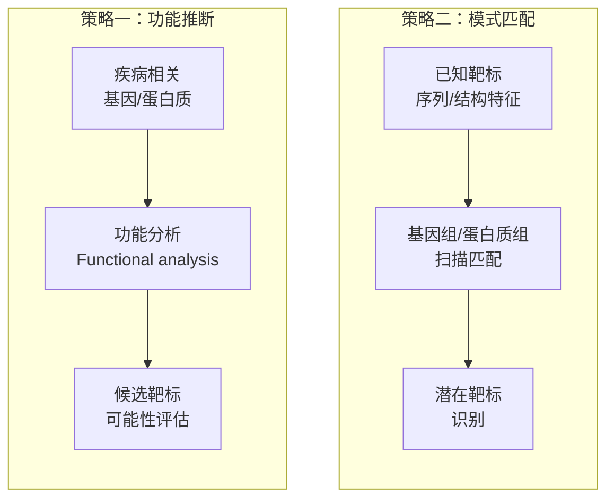
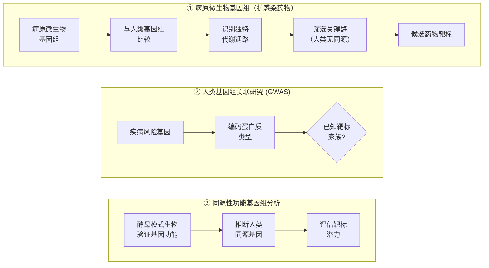
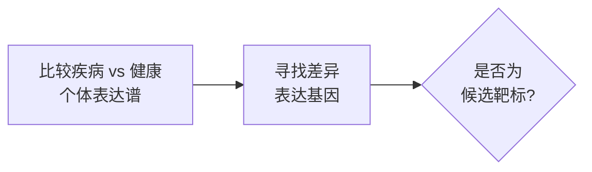
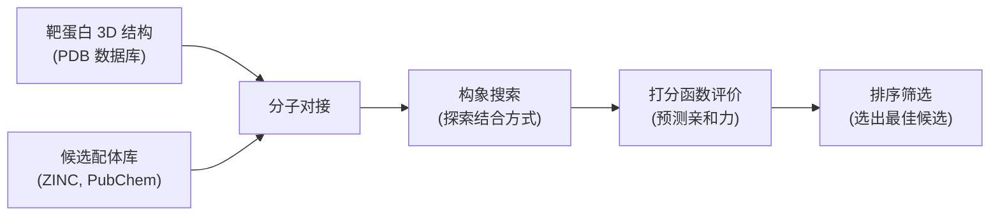
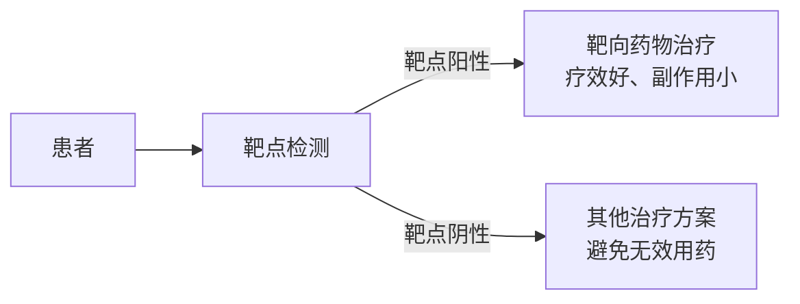

# 第十五章 药物生物信息学
## Pharmaceutical Bioinformatics

---
layout: default
---

# 本节学习目标 Learning Objectives

**Knowledge**
- 掌握药物靶标 (drug target) 概念与主要蛋白质家族；理解药物靶标发现的信息学策略
- 理解分子对接 (molecular docking) 与虚拟筛选 (virtual screening) 的基本流程
- 掌握药物基因组学 (pharmacogenomics) 的核心概念与研究方法
- 了解个体化药物治疗 (individualized drug therapy) 的临床应用

**Ability**
- 使用 DrugBank、PharmGKB 等数据库检索药物靶标与药物基因组信息
- 理解 Lipinski 五规则 (Rule of Five) 并判断小分子化合物成药性

**Thinking**
- 认识生物信息学在药物研发全链条中的价值
- 理解从"千人一量"到个体化用药的精准医学转变

---
layout: table-of-contents
contentTitle: '目录 | Contents'
contentItems:
  - 药物靶标与信息学资源
  - 虚拟筛选与药物设计
  - 药物基因组学
  - 个体化药物治疗
---

<!-- notes:
今天的课是药物生物信息学导论。我们分四个板块来讲：第一板块讲药物靶标——新药发现的起点，以及相关的数据库资源；第二板块讲虚拟筛选与药物设计——如何用计算机快速筛选候选药物；然后课间休息；第三板块讲药物基因组学——为什么不同人对同一药物反应不同；第四板块是个体化药物治疗——药物基因组学在临床上的成功案例。最后总结。

内容覆盖面比较广，但我们侧重生物信息学的角度。更深入的药物设计内容在后续的药物设计学课程中会详细讲解。
-->

---
layout: section
sectionNumber: 1
sectionTitle: '药物靶标与信息学资源'
sectionTitleEn: 'Drug Targets & Bioinformatics Resources'
---

---
layout: figure
figureUrl: '/assets/ch15/current_drug_discovery_flow.png'
figureCaption: '药品研发的全流程'
slideTitle: '药品研发的全流程示意图'
---

---
layout: default
---

# 引言：为什么需要药物生物信息学？
<v-clicks>

**药物研发的现实** [教材 §15.1]：
- 研发一个新药平均耗时 **10–15 年**，花费 **10–26 亿美元**
- 进入临床试验的候选药物中，仅约 **10%** 最终获批上市
- 失败主因：**有效性不足**、**毒性过大**、**个体差异未被充分考虑**

</v-clicks>

<v-clicks>

**生物信息学的价值**：
- **靶标发现**：从基因组/蛋白质组数据中发掘新药物靶点
- **虚拟筛选**：计算机预测化合物活性，降低实验筛选成本
- **药物基因组学**：解析药物反应个体差异，指导精准用药
- **数据整合**：整合多源数据库，加速药物研发决策

</v-clicks>

<!-- notes: 先给大家一个宏观图景。药物研发是一个高成本、高风险、长周期的过程。生物信息学可以在每个环节发挥作用。-->

---
layout: default
---

# 什么是药物靶标 (Drug Target)？

> **药物靶标** — 生理状态下物质代谢或信号通路的关键组成部分，药物通过与之结合发挥药理作用

有效药物靶标的基本特征：

<v-clicks>

1. **必要性**：对疾病病理过程的代谢或信号通路有控制作用
2. **终端性**：位于疾病相关通路的下游关键环节
3. **特异性**：不参与疾病无关组织的必需代谢过程
4. **独立性**：避开多个通路的交叉点，减少副作用

</v-clicks>

<v-clicks>

特征①是必要条件，②③④是充分条件。满足越多，靶标质量越高。

</v-clicks>

<!-- notes: 药物靶标是药物研发的起点。不是所有蛋白质都能成为好的靶标。四个特征中，第一个是必须的，后面三个越满足越好。-->

---
layout: default
---

# 人体蛋白质类药物靶点主要家族

| 靶点类别 | 英文名 | 治疗领域 |
|---------|--------|---------|
| **G 蛋白偶联受体** | G-protein coupled receptors | 代谢疾病、心血管、炎症 |
| **激酶** | Kinase | 肿瘤、炎症、病毒感染 |
| **核受体** | Nuclear receptor | 肿瘤、代谢疾病 |
| **离子通道** | Ion channel | 中枢神经、疼痛、肿瘤 |
| **磷酸二酯酶** | Phosphodiesterase | 炎症、心血管、勃起障碍 |
| **蛋白酶** | Protease | 炎症、骨组织疾病、肿瘤 |

<b>现状</b>：已确认药物靶标 >500 个，预计人体蛋白质类靶标总数可达 ~3000 个 [教材表15-1]

---
layout: default
---

# 药物靶标发现的两大信息学策略

<v-click>

**共同前提**：需要先验知识——药物分子和靶标数据库是关键资源

</v-click>

<!-- notes: 两种策略思路不同。策略一从疾病出发，找到相关基因后评估它作为靶标的可能性。策略二从已知靶标的特征出发，扫描整个基因组寻找匹配的候选。两种策略都需要数据库支撑。-->

---
layout: default
---

# DrugBank：最全面的药物信息数据库

**DrugBank** — 药物与靶标信息的综合资源 [教材 §15.2(一)]

| 数据类型 | 数量 |
|---------|------|
| 药物条目 | 19876 种 |
| FDA 批准小分子药物 | 3027 种 |
| 生物技术药物 | 4367 种 |
| 实验阶段药物 | 8874 种 |
| 关联靶标/蛋白质 | 5163 条 |

数据截至 2026 年 6 月（go.drugbank.com/stats）；DrugBank 持续增长，教材 §15.2(一) 的历史数据已据此更新。

<v-click>

**每种药物提供近 200 项信息**：靶点、SNP 分布、副反应、化学结构、药理性质等

- 支持多种搜索模式和可视化
- 可按生理系统/疾病分类浏览

</v-click>

<!-- notes: DrugBank 是药物信息检索的首选数据库。-->

---
layout: figure
figureUrl: '/assets/ch15/drugbank_interface.png'
figureCaption: 'DrugBank 界面示意 [教材图15-1]'
slideTitle: 'DrugBank 网站界面演示'
---

---
layout: default
---

# 其他核心药物数据库

| 数据库 | 全称 | 特色 |
|--------|------|------|
| **TTD** | Therapeutic Target Database | 2025 个靶点，17816 个药物-配体互作 |
| **KEGG DRUG** | KEGG 药物数据库 | 基于化学结构/靶标/代谢酶关联药物 |
| **DART** | Drug Adverse Reaction Targets | 药物副反应靶标 |
| **TRMPD** | Therapeutically Relevant Multiple Pathways | 多信号通路与靶标交叉信息 |
| **KDBI** | Kinetic Data of Bio-molecular Interaction | 生物分子互作动力学数据 |
| **BioGRID** | Biological General Repository for Interaction Datasets | 蛋白质/基因互作数据 |

<b>补充</b>：NRDB（NCBI 非冗余靶标库）、ADME（药代动力学蛋白）、TransportDB（转运蛋白）、PharmGED（药物遗传效应）、PubChem（化合物信息）、CSD（小分子晶体结构）

<!-- notes: 不需要每个都记，但要了解有哪些类型的资源可用。DrugBank 和 TTD 是最常用的两个。-->

---
layout: default
---

# 靶标发现：基因组分析策略

三种策略、同一目标——从基因组数据中找到可成药的靶标：

<!-- notes: 三种基因组层面的策略。微生物基因组直接比较就行，因为基因组小。人类基因组太大，需要通过 GWAS 或同源性分析来缩小范围。-->

---
layout: default
---

# 靶标发现：表达谱与蛋白质组学

**策略**（通用流程）

**案例：Bengamide → MetAP 靶标发现** [教材 §15.2(三)]

<b>思路</b>：已知活性物质 → 处理细胞 → 找变化的蛋白 → 确认靶标 → 结构验证

---
layout: figure
figureUrl: '/assets/ch15/1qzy_bengamide.png'
figureCaption: '甲硫氨酸氨肽酶 (MetAP) 与 Bengamide 衍生物的复合物晶体结构 (PDB: 1QZY) [教材图15-2]'
slideTitle: 'MetAP-Bengamide 复合物结构'
---

---
layout: default
---

# 靶标发现：反向对接与实验验证

<v-click>

**反向对接 (Reverse Docking)**
- 已知活性配体 → 从蛋白质结构数据库搜索潜在靶蛋白
- 特别适合发掘天然产物的未知靶标

</v-click>

<v-click>

**候选靶标的实验验证 — 五项确认标准**：

  <ol class="list-decimal pl-6 space-y-1">
    <li>靶标功能与动物模型疾病病理存在必然联系</li>
    <li>细胞模型中靶标功能与疾病过程存在必然联系</li>
    <li>配体达到有效浓度时与靶标发生明确互作</li>
    <li>体外互作数据可预测体内配体-靶标互作</li>
    <li>靶标含量/活性与病理过程有明确联系</li>
  </ol>

</v-click>

<v-click>

⚠️ 注意: 生物信息学预测的靶标必须经过实验验证才能进入药物开发流程。

</v-click>

<!-- notes: 反向对接是一种很有意思的技术——传统的正向对接是"已知靶标找药物"，反向对接是"已知药物找靶标"。预测出来的靶标必须用实验验证，五条标准缺一不可。-->

---
layout: default
---

# 第一节小结

**药物靶标发现的生物信息学路线**：

基因组分析 → 表达谱/蛋白质组学 → 反向对接 → 候选靶标 → 实验验证

    
**关键数据库**：DrugBank、TTD、KEGG DRUG

<b>关键概念</b>：
<ol>
    <li>药物靶标的 4 个特征</li>
    <li>6 大靶标蛋白质家族</li>
    <li>靶标发现的 3 种信息学策略</li>
</ol>

---
layout: table-of-contents
contentTitle: '目录 | Contents'
contentItems:
  - 药物靶标与信息学资源
  - 虚拟筛选与药物设计
  - 药物基因组学
  - 个体化药物治疗
---

---
layout: section
sectionNumber: 2
sectionTitle: '虚拟筛选与药物设计'
sectionTitleEn: 'Virtual Screening & Drug Design'
---

---
layout: default
---

# 小分子药物概述

**定义（广义）**：分子量 < 800 Da、能在体内发挥明确药理学作用的化合物 [教材 §15.2(四)(一)]

**狭义**：广义小分子药物中，除去多肽 (peptide) 和核苷酸 (nucleotide) 之外的药物

<v-clicks>

**关键成药性指标**：

| 指标 | 英文 | 含义 |
|------|------|------|
| **亲和力** | Affinity | 配体与靶标结合的强度 |
| **生物利用度** | Bioavailability | 药物到达作用部位的比例 |
| **生物转化** | Biotransformation | 体内代谢过程 |

**核心问题**：如何从数百万候选化合物中，高效找到安全有效的药物？

</v-clicks>

<!-- notes: 小分子药物是目前临床用药的主体。成药性有三个关键指标：亲和力决定药效，生物利用度决定能不能到达靶点，生物转化决定代谢和毒性。广义/狭义之分：广义含多肽、核苷酸；狭义排除二者（学生常问"多肽/核苷酸类药物分子量也常 < 800 Da，算不算小分子"——这正是教材给出两层定义的原因）。务必区分两套阈值：本页"小分子定义上限 800 Da"界定"什么算小分子"，后文 Lipinski 五规则的"口服成药阈值 500 Da"界定"什么算口服好药"，两者服务不同目的，并非矛盾。-->

---
layout: default
---

# 分子结构的信息化表示

**连接表 (Connection Table)** — 计算机表示分子结构的标准方式

**连接表包含**：
- 所有原子的属性（元素类型、坐标）
- 化学键的性质（单键/双键/三键）
- 空间关系信息

**常用格式**：SMD、MOL、MOL2

**蛋白质结构格式**也可用于小分子：
- PDB 格式记录原子坐标
- 键类型由键长度确定

<!-- notes: 计算机不能直接"看"化学结构，需要用连接表来表示。MOL 格式是最常用的。-->

---
layout: default
---

# 分子表面性质

**为什么需要了解分子表面？** — 分子对接需要评估配体与靶标的形状和理化互补性

### 范德华表面
vdW Surface
- 原子半径球面的集合
- 定义分子的"硬壳"

### 溶剂可接触表面
Solvent-accessible
- 探针分子中心的轨迹
- 溶剂分子能触及的区域

### 溶剂排斥表面
Solvent-excluded
- 探针分子与原子相切的表面
- 溶剂分子不能进入的区域

---
layout: default
---

# 疏水性 (Hydrophobicity) 与脂水分配系数

**疏水性** — 影响药物跨膜能力、与靶标结合、体内分布的关键性质

**脂水分配系数 (Partition Coefficient, P)**：

$$\log P = \sum_{i=1}^{n} a_i \times f_i + b_i \times f_i$$

- $f_i$：碎片脂水分配系数
- $a_i, b_i$：不同结构体系中相同碎片的数量

<v-click>

    
**logP 的意义**：

| logP 范围 | 含义 |
|-----------|------|
| logP < 0 | 亲水性强，易溶于水 |
| 0 < logP < 3 | 适中的疏水性 |
| logP > 5 | 疏水性过强，与膜脂/血浆蛋白结合率高 |

**最佳范围**：口服药物 logP 通常在 **1–3** 之间

</v-click>

<!-- notes: logP 是衡量疏水性的核心参数。太亲水的药物穿不过细胞膜，太疏水的药物会和膜脂结合走不开。-->

---
layout: default
---

# 电性参数与立体参数

**电性参数 (Electronic Parameters)** — 描述分子电荷分布

| 参数 | 符号 | 含义 |
|------|------|------|
| Hammett 参数 | $\sigma$ | 取代基对反应活性的影响 |
| 解离常数 | pKa | 化合物整体电性状态，影响 ADME |
| 诱导效应 | $\sigma_I$ | 取代基的电子吸引/推斥效应 |

**立体参数 (Steric Parameters)** — 描述分子空间形状

| 参数 | 含义 |
|------|------|
| Taft 立体参数 $E_s$ | 立体效应对反应中心的影响 |
| 摩尔折射率 MR | 近似代表分子体积 |
| 范德华体积 $V_w$ | 分子体积大小 |

这些参数用于建立<b>定量构效关系 (QSAR)</b> 模型，预测候选药物的活性。

---
layout: default
---

# Lipinski 五规则 (Rule of Five)

**判断口服小分子药物成药性的经验法则** [教材 §15.2(五)]

1. 分子量 < **500** Da
2. 脂水分配系数 logP < **5**
3. 氢键供体（N-H, O-H）< **5** 个
4. 氢键受体（N, O 原子数）< **10** 个

<v-click>

**实践意义**：
- 违反 ≥2 条 → 口服生物利用度可能很差
- 快速筛选工具，**不是绝对标准**（很多成功药物违反了五规则）
- 计算简单，可在虚拟筛选早期阶段快速过滤候选化合物

</v-click>

<!-- notes: Lipinski 五规则是药物化学最有名的经验法则之一。名字里的"五"是因为所有阈值都是 5 的倍数。这是一个快速筛选工具，不是绝对标准。-->

---
layout: default
---

# 虚拟筛选 (Virtual Screening) 的概念

**传统药物筛选的困境**：

| 方法 | 问题 |
|------|------|
| 常规筛选 | 成本高、效率低 |
| 高通量筛选 (HTS) | 样品制备仍需大量资源 |
| 组合化学库 | 候选化合物 > 700 万种 |

<v-click>

**虚拟筛选的解决方案**：

> 先用计算机筛选，再对优选化合物做实验验证 → 显著提高成功率、降低成本

</v-click>

<!-- notes: 虚拟筛选的核心思想：用计算机先筛一遍，把几百万个候选缩减到几百个，再做实验。-->

---
layout: default
---

# 分子对接 (Molecular Docking) 流程

**分子对接** — 预测配体与靶蛋白结合构象和亲和力

<b>关键假设</b>：配体与靶蛋白的结合构象越稳定（自由能越低），亲和力越高

我们来看一个视频，演示分子对接的基本流程

<!-- notes: 分子对接的输入是靶蛋白结构和候选配体库，输出是预测的结合构象和亲和力排序。-->

---
layout: default
---

# 打分函数 (Scoring Functions)

**评价配体-靶蛋白结合亲和力的数学模型**

### 基于物理化学
Physics-based
- 计算范德华力、静电、氢键等
- 精度较高，计算量大

### 基于经验
Empirical
- 拟合已知复合物数据
- 速度快，精度中等

### 基于知识
Knowledge-based
- 统计已知结构中的原子对距离
- 速度快，适合大规模筛选

<v-click>

**机器学习方法**：用已知活性数据训练模型（神经网络、决策树、KNN），预测未知配体亲和力
- 优势：计算效率高
- 局限：受训练集数据质量和来源限制

</v-click>

---
layout: default
density: compact
---

# 常用分子对接软件

| 软件 | 开发者 | 核心算法 | 柔性处理 | 特色 |
|------|--------|---------|---------|------|
| **DOCK** | UCSF, Kuntz 组 | 几何匹配 + 能量评分 | 配体柔性（二面角旋转） | 最早（1982），应用最广 |
| **AutoDock** | Olson 组 | 模拟退火 + 遗传算法 | 半柔性对接 | 结合自由能评价，单个配体对接 |
| **GOLD** | 遗传算法 | 子种群遗传算法 | 配体 + 部分受体柔性 | 氢键约束 |
| **MVD** | Molegro | 模板对接 | 配体柔性 | 准确率高 (87%)，界面友好 |
| **Affinity** | Accelrys/杜邦 | 蒙特卡罗 + MD 精化 | 双方柔性 | 精度高但计算量大 |

<b>选择建议</b>：大规模筛选用 DOCK/GOLD，精细互作分析用 AutoDock/Affinity，初学者推荐 MVD

---
layout: default
---

# 定量构效关系 (QSAR)

**QSAR** (Quantitative Structure-Activity Relationship) — 建立分子结构与生物活性的定量模型

**建模流程**：
1. 收集已知活性数据（训练集）
2. 提取分子描述符（疏水性、电性、立体参数）
3. 选择关键描述符（逐步回归、模式识别）
4. 建立预测模型（多元回归、神经网络）
5. 验证并预测新化合物

<b>3D-QSAR</b>：考虑三维结构特征的构效关系分析，如 CoMFA（比较分子场分析），是当前主流发展方向。

---
layout: default
---

# ADMET 预测

**ADMET** — 吸收、分布、代谢、排泄、毒性 [教材 §15.2(五)]

| 环节 | 英文 | 关注点 |
|------|------|--------|
| **A** 吸收 | Absorption | 口服生物利用度、肠道穿透性 |
| **D** 分布 | Distribution | 组织分布、脑血屏障穿透 |
| **M** 代谢 | Metabolism | CYP450 酶代谢、药物-药物互作 |
| **E** 排泄 | Excretion | 肾/肝清除率 |
| **T** 毒性 | Toxicity | 器官毒性、遗传毒性 |

<v-click>

**预测策略**：从分子结构特征出发，预测 ADMET 性质

- 经典方法：Lipinski 五规则（口服药物初步筛选）
- 进阶方法：机器学习模型、专家系统（COMPACT, DEREK, TOPKAT）
- 核心思想：**在药物发现早期就预测 ADMET**，显著提高成功率

</v-click>

<!-- notes: ADMET 预测的核心思想是"fail early, fail cheap"——越早发现问题，损失越小。-->

---
layout: default
---

# 第二节小结

**计算机辅助药物设计路线**：

分子结构描述 → 虚拟筛选 → 分子对接 → QSAR/ADMET → 候选药物 → 实验验证

**关键概念**：
- 小分子药物的三大成药性指标
- Lipinski 五规则 — 口服药物快速筛选
- 分子对接与打分函数
- QSAR 与 3D-QSAR
- ADMET 预测

说明: 更深入的分子对接与 QSAR 实操将在<b>药物设计学</b>课程中详细讲解。

---
layout: table-of-contents
contentTitle: '目录 | Contents'
contentItems:
  - 药物靶标与信息学资源
  - 虚拟筛选与药物设计
  - 药物基因组学
  - 个体化药物治疗
---

---
layout: section
sectionNumber: 3
sectionTitle: '药物基因组学'
sectionTitleEn: 'Pharmacogenomics'
---

---
layout: default
---

# 药物反应的个体差异

**临床现实** [教材 §15.3]：

- 约 **1/3** 的患者对药物治疗**无效**
- 约 **1/6** 的患者出现不同程度的**毒副反应**
- 总有效率不到 **50%**

<v-click>

**为什么会这样？**

同样的药物 → 同样的剂量 → 不同人的反应截然不同

> **核心原因**：遗传因素是影响药物 PK 和 PD 的主因

</v-click>

<!-- notes: 这是药物基因组学要解决的核心问题——为什么同一个药，有些人有效有些人无效，有些人还会中毒？-->

---
layout: default
---

# 药代动力学 (PK) 与药效动力学 (PD)

### PK 药代动力学
Pharmacokinetics
- 吸收 (Absorption)
- 分布 (Distribution)
- 代谢 (Metabolism)
- 排泄 (Excretion)
- 即"机体对药物做了什么"

### PD 药效动力学
Pharmacodynamics
- 药物靶点（受体、酶、离子通道）
- 浓度-效应关系
- 即"药物对机体做了什么"

<b>PK 和 PD 均受遗传和环境因素影响</b>，其中遗传因素是主因。

---
layout: default
---

# 从遗传药理学到药物基因组学

**发展历程**：

| 时间 | 里程碑 |
|------|--------|
| 1950s | 发现不同遗传背景患者对同一药物反应不同 |
| 1959 | Vogel 提出"遗传药理学 (Pharmacogenetics)" |
| 1997 | 药物基因组计划发起，进入基因组学时代 |

<v-click>

**两个概念的区别**：

| | 遗传药理学 | 药物基因组学 |
|---|----------|------------|
| **范围** | 单个基因变异 | 多个基因共同作用 |
| **目标** | 研究单基因对药物的影响 | 全基因组水平的药物反应差异 |
| **方法** | 候选基因 | GWAS、全基因组测序 |
| **学科** | 遗传学 + 药学 | 遗传学 + 生物信息学 + 药学 |

</v-click>

---
layout: default
---

# 药物基因组生物标志物发现：关联研究设计

**与疾病遗传学研究的类比** [教材 §15.3(二)]

> 核心方法：关联研究 (Association Study) — 同第十一章

<v-click>

**药物反应的表型**：
- 药物剂量需求
- 药物敏感性（有效/无效）
- 血药浓度
- 严重不良反应

</v-click>

<v-click>

**病例-对照分组**：
- **病例**：出现严重不良反应 / 对药物无反应的个体
- **对照**：无不良反应 / 对药物治疗有效的个体

</v-click>

<v-click>

<b>⚠️注意</b>：大多数病例-对照研究为<b>回顾性研究</b>，存在记忆偏倚等局限。

</v-click>

---
layout: default
---

# 候选基因关联分析

**候选基因** — 已知与药物反应可能相关的基因 [教材 §15.3(二)1]

**三类候选基因**：

| 类型 | 说明 | 示例 |
|------|------|------|
| **药物代谢酶基因** | 参与药物代谢的酶编码基因 | CYP450 家族 |
| **药物转运基因** | 药物吸收/分布/消除相关 | OATP 转运体 |
| **药物靶点基因** | 影响靶点特性与亲和力 | VKORC1（华法林靶点） |

<v-click>

**成功案例**：
- **CYP450 家族**：代谢酶多态性影响药物清除率
- **TPMT**：硫嘌呤甲基转移酶活性差异影响药物毒性
- **UGT1A1\*28**：单倍型与伊立替康毒性风险相关

</v-click>

<v-click>

**局限性**：假阳性/假阴性多；基于已知基因，发现新靶点能力不足

</v-click>

---
layout: default
---

# GWAS 在药物基因组学中的应用

**回顾**：GWAS 原理同第十一章，但应用于**药物反应表型**

**药物基因组 GWAS 的独特优势**：

严重药物不良反应的 GWAS 具有**非常高的统计效能**
- 氟氯西林肝损伤：仅 51 例 + 282 对照
- HLA-B\*5701 携带者 OR = **80.6** (p < 10⁻³³)

<v-click>

**发现新靶标的案例**：
- **PRKCA** rs16960228 → 氢氯噻嗪降压效果相关
  - 该基因之前**未被**认为是氢氯噻嗪候选基因 → GWAS 的独特价值

</v-click>

<v-click>

**局限性**：
多重比较更严重 → 假阳性风险高; 发现的变异多在基因间/内含子 → 需精细定位; 常忽略罕见变异

</v-click>

---
layout: default
---

# 基因组测序 (WGS/WES) 在药物基因组学中的应用

**优势**：一次性检测所有突变位点（包括罕见变异），无需精细定位

| 方法 | 全称 | 特点 |
|------|------|------|
| **WGS** | Whole Genome Sequencing | 全基因组覆盖，检测所有变异 |
| **WES** | Whole-Exome Sequencing | 只测外显子，成本较低 |

<v-click>

**案例：TSC1 突变与依维莫司疗效** [教材 §15.3(二)3]
- 依维莫司：mTOR 抑制剂，治疗前列腺癌
- 1 例完全应答患者 → WGS 发现 **TSC1 移码突变**
- 进一步分析：依维莫司仅对 **TSC1 突变阳性**患者有效

</v-click>

<v-click>

**采样策略**：极端表型家系测序 / 极端表型个体测序（降低样本量需求）

</v-click>

---
layout: default
---

# 三种发现方法的比较

| 维度 | 候选基因 | GWAS | WGS/WES |
|------|---------|------|---------|
| **覆盖范围** | 数个已知基因 | 全基因组常见变异 | 全基因组所有变异 |
| **罕见变异检测** | ✗ | ✗（MAF > 5%） | ✓ |
| **先验假设** | 需要 | 不需要 | 不需要 |
| **精细定位** | 不需要 | 需要 | 不需要 |
| **成本** | 低 | 中 | 高 |
| **数据分析难度** | 低 | 中 | 高 |
| **新基因发现** | 弱 | 强 | 最强 |

三种方法<b>互补</b>——实际研究中常组合使用。

---
layout: default
---

# 生物标志物的验证

**发现 ≠ 确认** — 关联研究鉴定的标志物需进一步验证 [教材 §15.3(二)]

**验证分两类**：

### 功能验证
- 分子/细胞生物学方法
- 确认标志物与药理机制的关系
- 例：构建不同基因型细胞 → 比较药物反应

### 临床试验验证
- RCT（随机对照试验）
- 确认个体化治疗方案的效能
- 金标准

<v-click>

**案例**：VKORC1 -1639 G>A 验证
- 定点诱变构建不同基因型细胞
- G 等位基因细胞 VKORC1 mRNA 表达**显著高于** A 等位基因
- → 解释了为什么不同基因型患者华法林剂量需求不同

</v-click>

---
layout: default
---

# 药物基因组学与新药开发

**FDA 2003 年发布药物基因组学资料呈送指南** [教材 §15.3(三)]

**四个应用方向**：

<v-clicks>

1. **发现新靶点**
   - 药物基因组研究发现与药效/毒性相关的基因/蛋白
   - 例：多巴胺受体突变 → 氯氮平疗效差异 → 新靶标
   

2. **筛选安全性和有效性的遗传因素**
   - 查明 PK/PD 相关基因 → 指导个体化应用
   - 早期发现缺陷 → 及时终止 → 节约成本

</v-clicks>

---
layout: default
---

# 药物基因组学与新药开发(cont.)

**FDA 2003 年发布药物基因组学资料呈送指南** [教材 §15.3(三)]

**四个应用方向**：

<v-clicks>

3. **评估不同基因型的 PK 参数**
   - 按基因型预估用药剂量
   - 例：SLCO1B1 521T>C → 他汀类药物剂量调整

4. **挽救"失败"药物**
   - 分析不良反应的遗传机制 → 特定人群重新应用
   - 例：BiDil 在非裔美国人群中有效

</v-clicks>

---
layout: default
density: compact
---

# SLCO1B1 基因型与他汀类药物剂量

**SLCO1B1 521T>C** 多态性影响 OATP1B 转运活性 → 血药浓度升高 → 肌病风险

| 药物 | TT (mg/d) | TC (mg/d) | CC (mg/d) | 常规范围 |
|------|-----------|-----------|-----------|---------|
| 辛伐他汀 | 80 | 40 | 20 | 5–80 |
| 阿托伐他汀 | 80 | 40 | 20 | 10–80 |
| 瑞舒伐他汀 | 20 | 10 | 10 | 5–20 |
| 普伐他汀 | 40 | 20 | 20 | 10–40 |
| 匹伐他汀 | 4 | 2 | 1 | 1–4 |
| 氟伐他汀 | 80 | 80 | 80 | 20–80 |

<b>启示</b>：同一药物，不同基因型患者需要的剂量可相差<b>4 倍</b> [教材表15-2]

---
layout: default
---

# PharmGKB：药物基因组学核心数据库

**PharmGKB** — 最权威的药物基因组学专用数据库 [教材 §15.4(一)]

| 数据类型 | 数量 |
|---------|------|
| 药物 | 3152 种 |
| 疾病 | 3445 种 |
| 基因 | 26960 个 |
| PK/PD 通路 | 102 个 |
| VIP 基因 | 42 个 |
| 个体化用药指南 | 226 个 |

**五大数据类别**：临床结局 (CO)、PD、PK、分子/细胞功能分析 (MCFA)、基因型 (GT)

---
layout: figure
figureUrl: '/assets/ch15/pharmgkb_interface.png'
figureCaption: 'PharmGKB 数据库检索界面（以 CYP2C19 为例）[教材图15-4]'
slideTitle: 'PharmGKB 检索示例'
---

---
layout: default
---

# ClinVar 与 COSMIC 数据库

**ClinVar** — 基因突变与临床表型数据库 (NCBI) [教材 §15.4(三)]

整合四大信息：变异 (dbSNP) + 表型 (MedGen/OMIM) + 注释 (ACMG) + 证据 (PubMed)

**COSMIC** — 癌症体细胞突变数据库 (Sanger Institute) [教材 §15.4(四)]

| 数据 | 数量 |
|------|------|
| 基因 | 27829 个 |
| 编码突变 | 1808915 个 |
| 拷贝数变异 | 674592 个 |
| 样本 | 999872 个 |

- 肿瘤体细胞突变筛查是**肿瘤药物基因组学**的重要方向
- 可按基因名、突变类型检索

此外还有<b>DMET</b> 和 <b>VeraCode ADME</b> 基因分型芯片，专门用于药物基因组学研究的高通量基因分型。

---
layout: figure
figureUrl: '/assets/ch15/clinvar_aspirin_search.png'
figureCaption: 'ClinVar 数据库检索示例（以 aspirin 为关键词）[教材图15-5]'
slideTitle: 'ClinVar 检索示例'
---

---
layout: default
---

# 第三节小结

**药物基因组学的核心逻辑**：

遗传变异 → PK/PD 差异 → 药物反应个体差异 → 个体化用药

**关键数据库**：PharmGKB、ClinVar、COSMIC、FDA

**关键方法**：
- 候选基因 / GWAS / WGS 三种发现策略（互补）
- 功能验证 + RCT 临床验证
- 四个新药开发应用方向

---
layout: table-of-contents
contentTitle: '目录 | Contents'
contentItems:
  - 药物靶标与信息学资源
  - 虚拟筛选与药物设计
  - 药物基因组学
  - 个体化药物治疗
---

---
layout: section
sectionNumber: 4
sectionTitle: '个体化药物治疗'
sectionTitleEn: 'Individualized Drug Therapy'
---

---
layout: default
---

# 肿瘤靶向治疗 (Targeted Therapy)

> **靶向药物** — 与癌症发生/生长所需的特定分子靶点作用，阻止癌细胞生长

**核心要求**：患者必须具有靶向药物的作用靶点

<v-click>

</v-click>

<v-click>

<b>关键</b>：先检测靶点，再决定是否用药——精准医学的典型范式。

</v-click>

---
layout: default
---

# HER2 与曲妥珠单抗 (Trastuzumab)

**HER2** — 人类表皮生长因子受体 2 [教材 §15.5(一)]

- 约 **30%** 乳腺癌患者 HER2 基因过度表达
- HER2 阳性 → 肿瘤恶性程度高、复发早、预后差
- **曲妥珠单抗**（2006 年 FDA 批准）— 与 HER2 受体特异性结合 → 促进降解

<v-click>

**疗效数据**：
- HER2 阳性患者：曲妥珠单抗辅助化疗 → 无病进展生存期**延长 2.8 个月**
- 已进入 NCCN 乳腺癌/胃癌临床实践指南

**检测方法**：FISH（荧光原位杂交）、IHC（免疫组化）、CISH（显色原位杂交）

</v-click>

---
layout: default
---

# HER2 基因扩增检测

**FISH 方法检测 HER2 基因扩增** [教材 §15.5(一)]

- 计数细胞中红色荧光信号（HER2 基因）
- 多数细胞红色信号 > 2 → HER2 扩增阳性
- 阳性患者适用曲妥珠单抗治疗

<b>要点</b>：只有 HER2 阳性的患者才能从曲妥珠单抗治疗中获益——这是药物基因组学指导临床用药的经典案例。

---
layout: default
---

# EGFR 突变与酪氨酸激酶抑制剂 (TKI)

**EGFR** — 表皮生长因子受体，酪氨酸激酶受体 [教材 §15.5(一)]

- EGFR 信号异常 → 多种肿瘤发生
- TKI（酪氨酸激酶抑制剂）抑制 EGFR 活性 → 阻碍肿瘤生长

**EGFR 突变分布（18-21 号外显子）**：

| 突变类型 | 占比 | TKI 敏感性 |
|---------|------|-----------|
| 19 号外显子缺失 + L858R | **90%** | **敏感** |
| T790M+其他 / G719X / L861Q / S768I | 7% | 有限敏感 |
| 仅 T790M / 20 号插入 / 其他 | 3% | 不敏感 |

<b>人群差异</b>：欧美非小细胞肺癌患者 EGFR 突变率 ~10%，东亚人群 **30–50%** → 东亚患者更应进行 EGFR 检测

---
layout: default
---

# 药物不良反应预测：卡马西平案例

**卡马西平 (Carbamazepine)** — 广泛使用的抗癫痫药物 [教材 §15.5(二)]

**问题**：部分患者服用后出现严重皮肤毒性
- **SJS**（史蒂文斯-约翰逊综合征）
- **TEN**（中毒性表皮坏死溶解）
- 欧美人群发生率 1/10000–6/10000
- 亚洲人群发生率**高出 10 倍以上**

<v-click>

**遗传机制**：**HLA-B\*1502** 等位基因

- 中国人群频率 **10%–15%**
- 携带者发生 SJS/TEN 风险**显著增加**

**解决方案**：用药前进行 HLA-B\*1502 基因检测

> → **药物基因组学避免药物不良反应最成功的案例之一**

</v-click>

<!-- notes: 卡马西平案例是药物基因组学在临床上最成功的应用之一。在中国人群中 HLA-B*1502 频率很高，所以在中国人群中进行基因检测特别重要。-->

---
layout: default
---

# 治疗窗 (Therapeutic Window) 与个体化剂量

**治疗窗** — 药物浓度在"有效"与"有毒"之间的安全范围

<v-click>

**问题**：治疗窗窄的药物，标准剂量下：
- 部分患者 → 浓度过低 → 无效
- 部分患者 → 浓度过高 → 毒性
- 需要根据**个体基因型**调整剂量

</v-click>

---
layout: default
---

# 华法林 (Warfarin) 剂量预测

**华法林** — 广泛使用的抗凝药，治疗窗极窄 [教材 §15.5(三)]

- 1990–2000 年 FDA 统计：华法林是导致严重不良事件最多的 10 种药物之一
- 同一种族个体间剂量需求可差 **100 倍以上**

<v-click>

**两个关键基因**：

| 基因 | 作用 | 效应 |
|------|------|------|
| **CYP2C9** | 代谢华法林的酶 | *2/*3 等位基因 → 酶活性降至 5–12% → 需更低剂量 |
| **VKORC1** | 华法林的作用靶点 | -1639 G>A → 表达降低 → 需更低剂量 |

**合计可解释约 30% 的华法林剂量变异**（加上年龄、体重等因素约 40%）

</v-click>

---
layout: default
density: compact
---

# IWPC 华法林剂量预测公式

**国际华法林遗传药理学联盟 (IWPC)** — 5052 例患者数据 [教材表15-4]

| 因素 | 回归系数 | 说明 |
|------|---------|------|
| 常数 | 5.6044 | |
| 年龄分级 | -0.2614 | 每 10 岁 1 级 |
| 身高 (cm) | +0.0087 | |
| 体重 (kg) | +0.0128 | |
| VKORC1 A/G | -0.8677 | 杂合子 |
| VKORC1 G/G | -1.6974 | 纯合子 |
| CYP2C9 *1/*3 | -0.9357 | |
| CYP2C9 *3/*3 | -2.3312 | |

预测公式：$\sqrt{\text{周剂量}} = 5.6044 - 0.2614 \times \text{年龄分级} + 0.0087 \times \text{身高} + \cdots$
 基因导向预测公式在<b>高剂量</b>和<b>低剂量</b>患者中优势尤为明显。

---
layout: default
---

# 华法林案例的启示

**成功之处**：
- 首次用遗传和环境因素构建剂量预测公式
- 在极端剂量患者中优势明显

**局限与展望**：
- 已知因素仅解释 **~40%** 剂量变异
- 前瞻性研究表明临床安全性提升仍有空间
- 未来需要：纳入更多因素、改进模型（如机器学习）

<v-click>

**药物基因组学的终极目标**：

从"千人一量" → **根据个体基因型精准给药**

</v-click>

---
layout: default
---

# 第四节小结

**三大个体化治疗模式**：

| 模式 | 案例 | 基因/靶标 | 临床应用 |
|------|------|----------|---------|
| **靶向治疗** | 曲妥珠单抗 / EGFR-TKI | HER2 / EGFR 突变 | 靶点检测后用药 |
| **不良反应预测** | 卡马西平 | HLA-B\*1502 | 用药前基因筛查 |
| **剂量预测** | 华法林 | CYP2C9 / VKORC1 | 基因型指导剂量 |

**共同特征**：先检测基因型 → 再制定治疗方案 → 精准医学范式

---
layout: default
---

# 本章总结

**药物生物信息学的全链条视角**：

**五大核心要点**：
1. 药物靶标是药物研发的起点，6 大蛋白质家族是主要靶点类型
2. DrugBank、TTD 等数据库为靶标发现提供关键资源
3. 虚拟筛选通过分子对接和 QSAR 加速候选药物识别
4. 药物基因组学解析药物反应个体差异的遗传基础
5. 个体化药物治疗是精准医学的核心实践

---
layout: default
---

# 思考题

1. 什么是药物基因组学？药物基因组学的研究目标是什么？

2. 常用的药物基因组学研究方法包括哪些？各自的优缺点是什么？

3. PharmGKB 数据库包括哪些主要内容？请以华法林为例在 PharmGKB 数据库中获取与华法林相关的信息。

4. 什么是癌症的靶向治疗？举一个例子说明靶向治疗的优势。

---
layout: default
---

# 延伸学习

**本课程是药物生物信息学的导论**，更深入的内容将在后续课程中展开：

**药物设计学 / AI与药物设计**：
- 分子对接实操（AutoDock Vina, Schrodinger）
- QSAR 建模与 3D-QSAR
- 药效团 (Pharmacophore) 模型
- 深度学习辅助药物设计 (AlphaFold + RDKit)

**推荐数据库资源**：
- DrugBank: https://go.drugbank.com
- PharmGKB: https://www.pharmgkb.org
- ChEMBL: https://www.ebi.ac.uk/chembl
- ZINC15: https://zinc15.docking.org

---
layout: end
endMessage: '谢谢聆听'
endMessageEn: 'Thank You'
---
